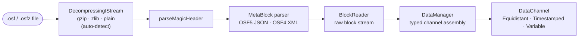
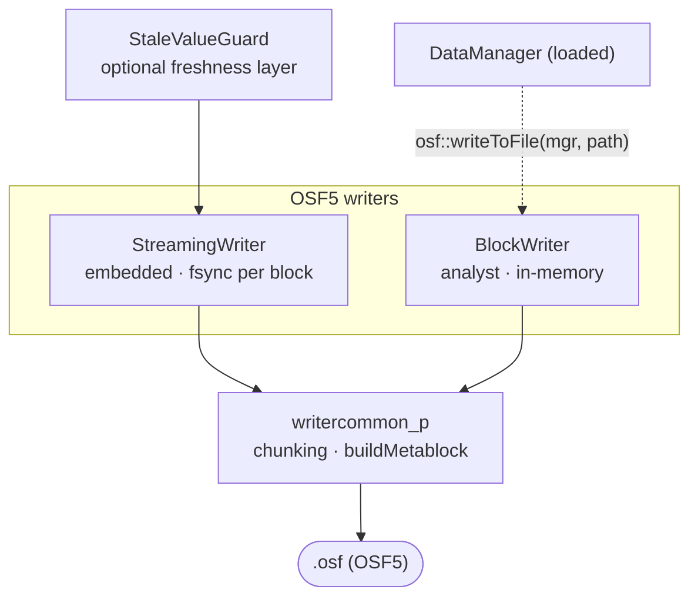
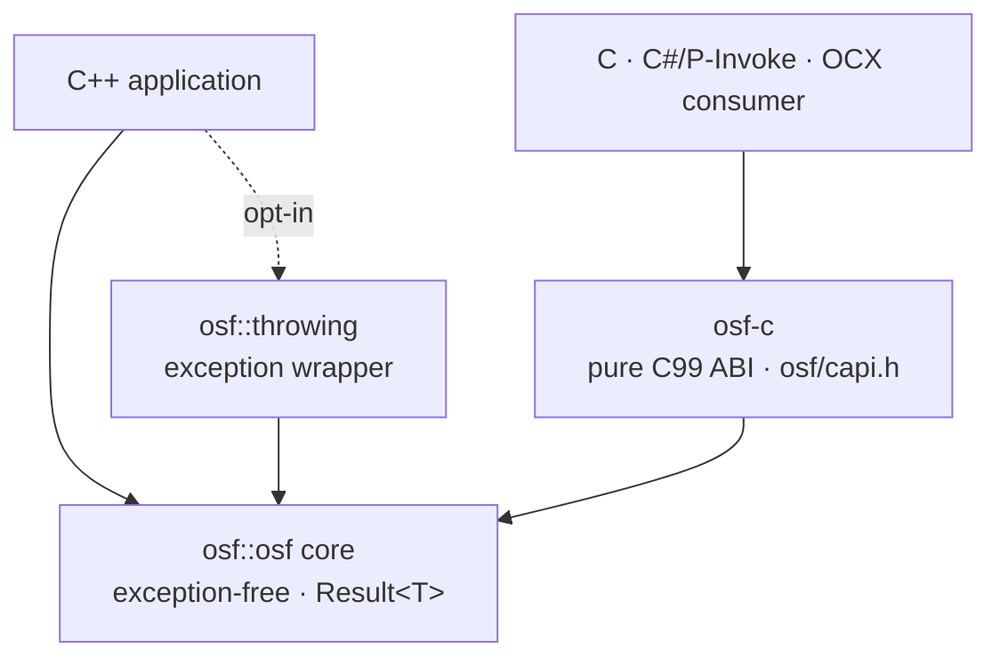

🇬🇧 [English version](../../en/implementations/cpp.md)

# C++-Implementierung

Eine **eigenständige C++17-Implementierung** des Open Streaming Format —
idiomatisches modernes C++ ohne externe Laufzeitabhängigkeiten. Sie liest
`.osf`- und `.osfz`-Dateien und schreibt OSF5. Die Bibliothek ist komplett
selbstständig nutzbar und distributierbar; ihr Verhalten ist allein durch
die OSF-Format-Spezifikation definiert.

:::tip Entwickler-Handbuch
Diese Seite ist der Überblick. Die ausführliche Entwicklerdokumentation
steht im Unterkapitel **C++ im Detail**:

| Seite | Inhalt |
|---|---|
| [Architektur](cpp/architecture.md) | Schichtenmodell, Module, Datenmodell, Designentscheidungen, Thread-Sicherheit |
| [Lesen](cpp/reading.md) | `DataManager`, `DataChannel`, Segmente, `BlockReader`, `ReaderStats`, transparentes OSFZ |
| [Schreiben](cpp/writing.md) | `StreamingWriter`, `BlockWriter`, `StaleValueGuard`, `ChannelDef`, Metadaten-Defaults, Round-Trip |
| [Fehlerbehandlung](cpp/error-handling.md) | `Result<T>`, vollständiger Fehlercode-Katalog, `osf::throwing` |
| [C-ABI](cpp/c-abi.md) | `osf-c` — Ownership-Regeln, Funktionskatalog, C- und P/Invoke-Beispiele |
| [Bauen & Einbinden](cpp/building.md) | CMake-Optionen, Targets, `add_subdirectory`/FetchContent, Doxygen, CI |
| [Kochbuch](cpp/cookbook.md) | kopierfertige Rezepte von Inspektion bis Embedded-Schleife |
| [Interna](cpp/internals.md) | Encoder, Chunking-Mathematik, Builder-Zustandsmaschine — für Mitwirkende |
:::

## Funktionsumfang

Die Implementierung ist **funktional vollständig**.
Lese- und Schreibpfad sind durch eine
GoogleTest-/ctest-Suite abgedeckt (0 Warnungen unter MSVC `/W4 /permissive-`),
und CI baut und testet auf **Linux, macOS und Windows**.

**Lesepfad**

- Magic-Header-Parser; OSF5-JSON- und OSF4-XML-Metablock-Parser
- Block-Stream-Reader und der typisierte `DataManager` (einheitlicher
  In-Memory-Reader mit typisierten Kanälen)
- Transparente **OSFZ**-Dekompression (gzip/zlib) — `.osf` und `.osfz`
  werden über dieselbe API gelesen
- **Best-Effort**: abgeschnittene Dateien (Stromausfall) liefern alle
  vollständig lesbaren Blöcke; unbekannte zukünftige Datentypen werden
  übersprungen statt das Laden abzubrechen

**Schreibpfad (OSF5)**

- `StreamingWriter` — eingebettet, Sample für Sample, `fsync` pro Block
  (ausfallsicher bei Stromverlust), konstanter Speicherbedarf
- `BlockWriter` — analystenfreundlich, sammelt im Speicher und schreibt
  die komplette Datei am Ende; passt `sizeOfLengthValue` bei Bedarf
  automatisch von 2 → 4 an
- `StaleValueGuard` — optionale Frische-Schicht, die den letzten Wert
  inaktiver Kanäle erneut ausgibt
- Automatische Metadaten-Defaults: `created_utc` wird beim Schreiben
  gestempelt; `creator`/`tag` erhalten Fallbacks, wenn nicht gesetzt

**Komfort und Anbindung**

- Eine **werfende Komfort-Schicht** (`osf::throwing`) über dem
  `Result<T>`-Kern für Aufrufer, die Exceptions bevorzugen
- Die **C-ABI-Bibliothek `osf-c`** (`osf/capi.h`) — eine reine C99-Schicht
  für die sprachübergreifende Nutzung (DLL/Shared Object)

## Architektur im Überblick

Zwei API-Ebenen liegen auf einem gemeinsamen, exception-freien Kern (`osf::Result<T>`). Die Lese-Seite stellt aus dem Block-Stream typisierte Kanäle zusammen; die Schreib-Seite bietet zwei Writer-Klassen für unterschiedliche Einsatzprofile; und ein C-ABI macht das Ganze für Nicht-C++-Konsumenten zugänglich. Vertiefung: [Architektur](cpp/architecture.md).

### Lesepfad



`DataManager::loadFromFile()` steuert diese gesamte Pipeline; OSFZ wird automatisch erkannt und dekomprimiert, sodass `.osf` und `.osfz` denselben Aufruf verwenden.

### Schreibpfad (OSF5)



### Schichten & C-ABI



### Welche Klasse wofür

| Ich möchte … | Klasse | Hinweise |
|---|---|---|
| Datei lesen, typisierte Kanäle erhalten | `osf::DataManager` | Zentraler Einstiegspunkt — `loadFromFile()`, `channel("name")`. Liest `.osf` und `.osfz`. → [Lesen](cpp/reading.md) |
| Den rohen Block-Stream iterieren | `osf::BlockReader` | Niedrigere Ebene; für sehr große Dateien und Streaming-Konsumenten. → [Lesen](cpp/reading.md) |
| Samples eines Kanals halten | `osf::DataChannel` | Variante über Equidistant / Timestamped / Variable; typisierte Flat-Accessoren. → [Lesen](cpp/reading.md) |
| Auf einem Embedded-Gerät aufzeichnen | `osf::StreamingWriter` | `fsync` pro Block, konstanter Speicher, ausfallsicher bei Stromverlust. → [Schreiben](cpp/writing.md) |
| Komplette Datei in einem Schritt schreiben | `osf::BlockWriter` | Sammelt im Speicher, schreibt bei `writeToFile()`; passt `sizeOfLengthValue` automatisch an. → [Schreiben](cpp/writing.md) |
| Inaktive Kanäle „frisch" halten | `osf::StaleValueGuard` | Gibt den letzten Wert von Kanälen erneut aus, die einen Schwellwert überschritten haben. → [Schreiben](cpp/writing.md) |
| Round-Trip / OSF4 → OSF5 | freie Funkt. `osf::writeToFile(mgr, …)` | Lädt einen `DataManager` in einen `BlockWriter` und schreibt OSF5. → [Kochbuch](cpp/cookbook.md) |
| Exceptions statt `Result<T>` verwenden | `osf::throwing` | Opt-in-Header; nicht in den Kern einkompiliert. → [Fehlerbehandlung](cpp/error-handling.md) |
| Aus C, C#, OCX … aufrufen | `osf-c` (`osf/capi.h`) | Reines C99-ABI; mit `-D OSF_BUILD_C_API=ON` bauen. → [C-ABI](cpp/c-abi.md) |

### Lauffähige Beispiele

`implementations/cpp/examples/` enthält vier kleine Programme über `<osf/osf.h>` —
**`inspect`** (Header / Metadaten / Kanäle, transparentes OSFZ), **`dump`**
(Sample-Werte), **`write`** (OSF5 synthetisieren und schreiben) und **`copy`**
(Round-Trip). Sie werden mit `-D OSF_BUILD_EXAMPLES=ON` gebaut (standardmäßig aktiv).
Ausgearbeitete Code-Rezepte: [Kochbuch](cpp/cookbook.md).

## Bauen — Schnellstart

```bash
cmake -B build
cmake --build build
ctest --test-dir build
```

Plattform­spezifische Hinweise, CMake-Optionen und FAQ stehen in der
mitgelieferten `BUILD.md` der Bibliothek und auf der Seite
[Bauen & Einbinden](cpp/building.md).

### CMake-Optionen

| Option | Standard | Wirkung |
|---|---|---|
| `OSF_BUILD_TESTS` | `ON` | GoogleTest/ctest-Suite bauen |
| `OSF_BUILD_EXAMPLES` | `ON` | die lauffähigen Beispielprogramme unter `examples/` bauen |
| `OSF_BUILD_DOCS` | `OFF` | Doxygen-API-Referenz erzeugen (Ziel `osf-docs`; erfordert Doxygen) |
| `OSF_BUILD_C_API` | `OFF` | die C-ABI-Bibliothek `osf-c` (+ C-Test) mitbauen |
| `OSF_USE_SYSTEM_ZLIB` | `OFF` | System-zlib statt FetchContent verwenden |
| `OSF_WARNINGS_AS_ERRORS` | `OFF` | Warnungen als Fehler (`/WX` bzw. `-Werror`); in CI `ON` |
| `BUILD_SHARED_LIBS` | `OFF` | die Kern-Bibliothek als Shared Library bauen |

C++17 ist die fest definierte Sprachbaseline der Bibliothek. Der Wechsel auf C++20 oder höher ist ein bewusstes Library-Upgrade, keine Build-Option. Drittanbieter-Code (`tl::expected`,
`nlohmann/json`, `pugixml`) ist im Repository unter `third_party/`
mitgeliefert; zlib kommt per FetchContent oder System.

### Einbinden

Die Bibliothek exportiert zwei CMake-Ziele:

- `osf::osf` — die Kern-Bibliothek (Standard statisch; Dateiname `libosf.a`
  / `osf.lib`)
- `osf::headers` — ein INTERFACE-Ziel mit den öffentlichen Include-Pfaden

Einbindung per `add_subdirectory` oder `FetchContent` —
Beispiel-Snippets auf [Bauen & Einbinden](cpp/building.md).

## API im Überblick

Der Kern ist **exception-frei**: Operationen, die scheitern können, geben
`osf::Result<T>` zurück (ein `tl::expected<T, osf::Error>`).
Der vollständige Fehlercode-Katalog steht unter
[Fehlerbehandlung](cpp/error-handling.md).

### Lesen

```cpp
#include <osf/manager.h>

auto result = osf::DataManager::loadFromFile("messung.osf");  // auch .osfz
if (!result) {
    // result.error().message  —  strukturierter Fehler, keine Exception
    return;
}
osf::DataManager const& mgr = *result;

// Kanal über den Namen ansprechen (primäre Zugriffsform)
if (osf::DataChannel const* ch = mgr.channel("Sensor.Temperatur")) {
    auto werte = osf::asDoublesFlat(
        std::get<osf::TimestampedChannel>(*ch));   // typisierter Zugriff
}
```

Wer lieber mit Exceptions arbeitet, nutzt die opt-in-Schicht:

```cpp
#include <osf/throwing.h>

auto mgr = osf::throwing::load("messung.osf");   // wirft osf::Exception bei Fehler
```

### Schreiben (OSF5)

```cpp
#include <osf/blockwriter.h>

osf::BlockWriter writer;
writer.setCreator("mein-tool/1.0");

osf::ChannelDef def;
def.name        = "signale.sinus";
def.dataType    = osf::DataType::Double;
def.channelType = osf::ChannelType::Scalar;

auto idx = writer.addChannel(def);              // Result<uint16_t>
// … Samples zu *idx hinzufügen (addTimestampedSample, addEquidistantSegment, …)
writer.writeToFile("ausgabe.osf");
```

Für eingebettetes, ausfallsicheres Schreiben gibt es stattdessen den
`StreamingWriter` (`fsync` pro Block). Ein geladener `DataManager` lässt
sich mit der freien Funktion `osf::writeToFile(mgr, pfad)` direkt als
OSF5 zurückschreiben (Round-Trip / OSF4 → OSF5). Alle Details und die
Wahl des richtigen `sizeOfLengthValue`: [Schreiben](cpp/writing.md).

### C-ABI (`osf-c`)

Mit `-D OSF_BUILD_C_API=ON` entsteht zusätzlich die Shared Library
`osf-c` mit einer reinen C99-Schnittstelle (`osf/capi.h`): opake Handles
(`osf_manager`, `osf_channel`), `osf_status`-Codes, eine thread-lokale
`osf_last_error_message()` und Copy-out-Reader für Zeitstempel und Werte —
plus `osf_write_to_file` für den Round-Trip-Schreibpfad. Keine C++-Exception
überschreitet die ABI-Grenze. Gedacht für die Anbindung aus C, C#/P-Invoke,
ActiveX/OCX und künftige Sprach-Bindings. Funktionskatalog und Beispiele:
[C-ABI](cpp/c-abi.md).

## Hinweise

- **Nur OSF5 wird geschrieben** — auch wenn die Quelle eine
  OSF4-Datei war.
- **OSFZ beim Schreiben ist ein nachgelagerter Schritt**: Die Writer komprimieren nie inline; OSFZ (gzip) entsteht *nach* dem Abschluss der `.osf`-Datei — durch einen zukünftigen Post-Close-Kompressor (Hintergrund-Thread) oder ein eigenständiges Compress-CLI. OSFZ wird **gelesen** transparent.
- **Best-Effort beim Lesen**: abgeschnittene Dateien liefern alle Daten bis
  zum letzten vollständig lesbaren Block, ohne Absturz.
- Die Bibliothek ist **Qt-neutral**; ein Qt-naher Zusatz kann später als
  eigener `integrations/`-Eintrag folgen.

## Quellcode und weiterführende Informationen

- Quellcode: [github.com/optimeas/osf](https://github.com/optimeas/osf),
  Verzeichnis `implementations/cpp/`
- Bauanleitung: `BUILD.md` im Bibliotheksverzeichnis — Zusammenfassung
  unter [Bauen & Einbinden](cpp/building.md)
- API-Referenz: Mit Doxygen über `-D OSF_BUILD_DOCS=ON` erzeugen (Ziel `osf-docs`) — siehe [Bauen & Einbinden](cpp/building.md)
- Format-Spezifikation: Kapitel [OSF-Format](../osf_general.md)

> Dieses Dokument ist lizenziert unter [CC BY 4.0](https://creativecommons.org/licenses/by/4.0/deed.de). Namensnennung: optiMEAS GmbH und optiMEAS Switzerland GmbH.
