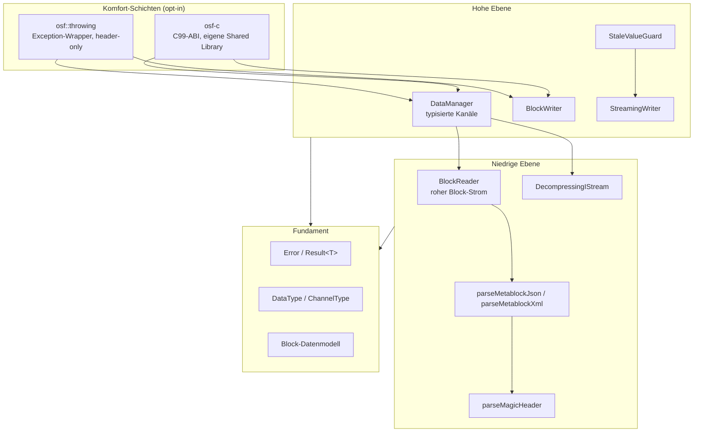
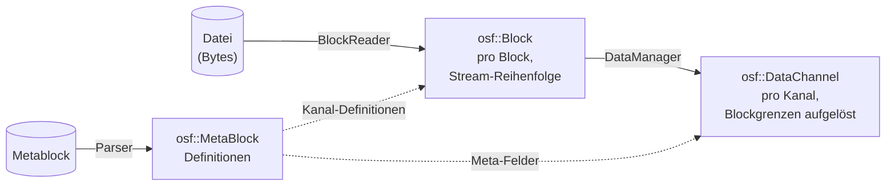

# Architektur der C++-Implementierung

Diese Seite beschreibt den inneren Aufbau der C++-Implementierung:
das Schichtenmodell, die Module und ihr Zusammenspiel, das Datenmodell
und die zentralen Designentscheidungen. Sie richtet sich an Entwickler,
die die Bibliothek einbinden **und** an solche, die daran mitarbeiten
wollen. Einen schnellen Überblick gibt die
[Übersichtsseite](../cpp.md); die Detail-Themen Lesen, Schreiben,
Fehlerbehandlung, C-ABI und Build haben eigene Seiten.

## Leitlinien

Die Implementierung folgt vier Grundsätzen:

1. **Eigenständiges C++17.** Idiomatisches modernes C++ ohne
   Fremdsprach-Brücken und ohne externe Laufzeitabhängigkeiten; das
   Verhalten ist allein durch die OSF-Format-Spezifikation definiert.
2. **Exception-freier Kern.** Jede Operation, die scheitern kann, gibt
   `osf::Result<T>` zurück (ein `tl::expected<T, osf::Error>`).
   Exceptions gibt es nur in der opt-in-Schicht `osf::throwing`.
3. **Best-Effort beim Lesen.** Abgeschnittene Dateien (Stromausfall
   beim Embedded-Schreiber) liefern alle vollständig lesbaren Blöcke
   statt eines Fehlers; unbekannte zukünftige Datentypen werden
   übersprungen statt das Laden abzubrechen.
4. **Schlanke Abhängigkeiten.** Drei vendorte Header-Bibliotheken
   (`tl::expected`, `nlohmann/json`, `pugixml`) plus zlib (FetchContent
   oder System). Keine Boost-, keine Qt-Abhängigkeit.

## Schichtenmodell



Die meisten Anwendungen arbeiten ausschließlich auf der hohen Ebene
(`DataManager` zum Lesen, einer der beiden Writer zum Schreiben). Die
niedrige Ebene ist öffentlich und stabil — wer streamend lesen oder
eigene Werkzeuge bauen will, benutzt `BlockReader` direkt.

## Module und Verantwortlichkeiten

| Header | Inhalt | Schicht |
|---|---|---|
| `osf/error.h` | `Error` (Code + Message), `Result<T>` | Fundament |
| `osf/types.h` | `DataType`, `ChannelType`, `SpectrumType` + Parser | Fundament |
| `osf/header.h` | Magic-Header: `OsfVersion`, `MagicHeader`, `parseMagicHeader` | Niedrig |
| `osf/metablock.h` | `MetaBlock`/`FileInfo`/`Channel`/`Info`; JSON- und XML-Parser; JSON-Serialisierung | Niedrig |
| `osf/block.h` | Block-Datenmodell: `Block`, `BlockKind`, Payload-Varianten, Control-Byte-Decoder | Fundament |
| `osf/reader.h` | `BlockReader` — Iterator über den Block-Strom | Niedrig |
| `osf/stats.h` | `ReaderStats` / `ChannelStats` — Lese-Telemetrie | Niedrig |
| `osf/compression.h` | `DecompressingIStream`, `detectCompression` — transparentes OSFZ | Niedrig |
| `osf/datachannel.h` | `DataChannel`-Variante (Equidistant / Timestamped / Variable), `Segment`, Flat-Accessoren | Hoch |
| `osf/manager.h` | `DataManager` — Laden + typisierte Kanalliste | Hoch |
| `osf/streamingwriter.h` | `StreamingWriter` + `ChannelDef` | Hoch |
| `osf/blockwriter.h` | `BlockWriter` + freie Funktionen `writeToFile` / `writeTo` | Hoch |
| `osf/stalevalueguard.h` | `StaleValueGuard` — Frische-Schicht über `StreamingWriter` | Hoch |
| `osf/binarysample.h` | `BinarySample` — nicht-besitzende Byte-Sicht (Span-Ersatz) | Fundament |
| `osf/throwing.h` | `osf::Exception`, `throwing::unwrap/load/writeToFile` — **nicht** im Umbrella | Komfort |
| `osf/capi.h` | reines C99-ABI der Bibliothek `osf-c` — **nicht** im Umbrella | Komfort |
| `osf/osf.h` | Umbrella-Header (alles außer `throwing.h` und `capi.h`) | — |
| `osf/version.h` | generiert; `osf::version()` und `OSF_VERSION_*` | Fundament |

Private Implementierungsbausteine (unter `src/`, nicht installierbar):
`blockencode_p.{h,cpp}` (OSF5-Block-Encoder), `writercommon_p.{h,cpp}`
(Chunking-Mathematik + Metablock-Assembly), `durablefile_p.{h,cpp}`
(RAII-Datei mit `fsync`), `binaryio_p.h` (Little-Endian-Helfer).
Details siehe [Interna](interna.md).

## Drei Datenmodelle — wer sieht was

Die Bibliothek hat bewusst drei Repräsentationen derselben Daten, je
nach Abstraktionsebene:



1. **`osf::MetaBlock`** (`metablock.h`) — die *Definitionen*:
   Datei-Metadaten (`FileInfo`), Kanal-Definitionen (`osf::Channel`)
   und optionale `Info`-Einträge. OSF4 (XML) und OSF5 (JSON)
   unterscheiden sich nur in der Serialisierung; beide Parser füllen
   dasselbe Modell symmetrisch.
2. **`osf::Block`** (`block.h`) — die *Stream-Sicht*: ein dekodierter
   Block mit Kanalindex und `BlockKind`-Variante (`StartData`,
   `ContinuedData`, `AbsTimestampData`, `ContinuedRelStampData`,
   `Skipped`). Payloads sind ausgepackte, typisierte Vektoren — kein
   Zero-Copy (Blöcke sind KB bis wenige MB groß; die einfache
   Lebensdauer-Semantik wiegt die Allokation auf).
3. **`osf::DataChannel`** (`datachannel.h`) — die *Kanal-Sicht*:
   eine `std::variant` über drei Speicher-Layouts, weil sich die
   Speicherung tatsächlich unterscheidet:

   | Variante | Speicherung |
   |---|---|
   | `EquidistantChannel` | flacher Sample-Vektor + `std::vector<Segment>` |
   | `TimestampedChannel` | parallele Vektoren `timestampsNs` + `values` |
   | `VariableChannel` | Timestamps + String- **oder** Binary-Samples |

**Namenshinweis:** `osf::Channel` ist die *Kanal-Definition* aus dem
Metablock; `osf::DataChannel` sind die *zusammengesetzten Samples*.
Beide teilen sich den Namespace `osf`, daher die unterschiedlichen
Namen.

## Namens- und API-Konventionen

- **Typen** in PascalCase (`DataManager`, `BlockReader`).
- **Methoden und freie Funktionen** in camelCase (`loadFromFile`,
  `channelName`, `asDoublesFlat`, `writeToFile`).
- **Öffentliche Struct-Felder** in camelCase ohne Präfix (`blocksTotal`,
  `sizeOfLengthValue`, `startTimestampNs`, `compressionFormat`).
- **Private Member** mit `m_`-Präfix + camelCase (`m_channelData`,
  `m_writer`).
- **Konstanten** in UPPER_SNAKE_CASE (`MAX_MAGIC_HEADER_LEN`,
  `GPS_WIRE_SIZE`).
- **Header-Dateinamen** kleingeschrieben, ohne Trennzeichen, Endung
  `.h` (`blockwriter.h`, `streamingwriter.h`, `datachannel.h`).
  Interne Header im `src/`-Verzeichnis erhalten den `_p.h`-Suffix
  (`blockencode_p.h`, `writercommon_p.h`).
- Das **C-ABI** (`osf_*`-Symbole in `osf/capi.h`) folgt der
  C-üblichen `snake_case`-Konvention und ist von den C++-Regeln
  ausgenommen.
- Diskriminatoren in Varianten heißen `kind` (`BlockKind`,
  `SkipReason::Kind`, `VariableValueRef::Kind`).
- Alles Fehlbare gibt `Result<T>` zurück und ist `[[nodiscard]]`.
- Konstruktion über statische Fabriken (`DataManager::loadFromFile`)
  oder Builder-artige Konfiguration (Writer: `set*` → `addChannel` →
  Schreibphase).
- Fluent-Setter am `BlockReader` (`withCaptureSkippedPayload`,
  `withFileSize`) geben `BlockReader&` zurück.
- Zeitstempel sind durchgehend `std::int64_t` **Nanosekunden seit der
  Unix-Epoche (UTC)**; Abtastraten `double` in Hz.

## Zentrale Designentscheidungen

### `Result<T>` statt Exceptions im Kern

Die Bibliothek zielt auch auf Embedded- und Industrie-Codebasen, in
denen Exceptions deaktiviert oder unerwünscht sind. Der Kern wirft
deshalb nie; `tl::expected` (vendort, CC0) liefert die Monade. Wer
Exceptions bevorzugt, nimmt [`osf::throwing`](fehlerbehandlung.md) —
eine dünne, header-only Schicht, die bewusst **nicht** in den
Umbrella-Header aufgenommen wurde, damit Kern-Nutzer keine
Exception-Maschinerie einziehen.

### Best-Effort und Vorwärtskompatibilität

Reale OSF-Dateien entstehen auf Geräten, die jederzeit die
Stromversorgung verlieren können, und mit Spec-Ständen, die der
Leser noch nicht kennt. Daraus folgen drei Verhaltensregeln:

- **Trunkierung ist kein Fehler.** Endet die Datei mitten im Block,
  liefert der `BlockReader` alle vollständigen Blöcke, erhöht
  `stats().blocksTruncated` auf 1 und beendet die Iteration sauber.
- **Unbekanntes wird übersprungen, nicht verschluckt.** Kanäle mit
  unbekanntem (zukünftigem) Datentyp parsen als
  `DataType::Unsupported`; ihre Blöcke erscheinen als
  `BlockKind::Skipped` (Payload-Bytes werden konsumiert, damit der
  Strom ausgerichtet bleibt). Die Original-Schreibweise bleibt auf
  `Channel::dataTypeRaw` erhalten.
- **Entfernte Spec-Elemente sind harte Fehler.** Datentypen, die die
  Spec-Revision 2026-05-04 entfernt hat (`pair`, `triple`, `candata`,
  `gpsdata`), werden mit `Error::Code::RemovedInSpec` abgelehnt —
  ihr Payload-Layout lässt sich aus einem aktuellen Build nicht
  reproduzieren, stilles Raten wäre Datenkorruption.

### Zwei Writer statt einem

`StreamingWriter` (Embedded: `fsync` pro Block, konstanter Speicher,
ausfallsicher) und `BlockWriter` (Analyst: sammelt im Speicher, emittiert
am Ende, kann `sizeOfLengthValue` automatisch anheben) haben
unvereinbare Invarianten — ein gemeinsamer Writer hätte beide Profile
verwässert. Gemeinsame Bausteine (Chunking, Metablock-Assembly) leben
in `src/writercommon_p.*`. Details auf der Seite [Schreiben](schreiben.md).

### Transparentes OSFZ nur beim Lesen

OSFZ (= gzip- oder zlib-komprimiertes OSF) wird beim **Lesen**
transparent erkannt und dekomprimiert (`DecompressingIStream` vor dem
Magic-Header-Parse). Beim **Schreiben** komprimiert die Bibliothek
bewusst nie inline: Kompression ist ein nachgelagerter
Schritt nach dem Datei-Abschluss, damit Schreib- und
Kompressions-Fehlermodi entkoppelt bleiben.

### Thread-Sicherheit

| Klasse | Vertrag |
|---|---|
| `DataManager` (geladen) | unveränderlich → beliebig parallel lesbar |
| `BlockReader` | nicht thread-safe; eine Instanz pro Thread |
| `StreamingWriter` / `BlockWriter` / `StaleValueGuard` | nicht thread-safe; Aufrufe extern serialisieren (z. B. `std::mutex`) |
| verschiedene Writer auf verschiedene Dateien | parallel unproblematisch |
| `osf-c` | `osf_last_error_message()` ist thread-lokal; Handles nicht über Threads teilen, ohne zu serialisieren |

## Verzeichnislayout

```
implementations/cpp/
├── CMakeLists.txt           — Projekt, Optionen, Targets
├── BUILD.md                 — Bauanleitung (EN)
├── cmake/                   — CompilerWarnings.cmake, version.h.in
├── include/osf/             — öffentliche Header (API-Fläche)
├── src/                     — Implementierung + private Header
├── tests/
│   ├── unit/                — GoogleTest-Units (synthetische Daten)
│   ├── integration/         — Tests gegen examples/*.osf(z)
│   └── c_api/               — reiner C99-Test für osf-c
├── examples/                — inspect, dump, write, copy
└── third_party/             — tl::expected, nlohmann/json, pugixml (vendort)
```

## Weiterführend

- [Lesen — DataManager, DataChannel, BlockReader, OSFZ](lesen.md)
- [Schreiben — StreamingWriter, BlockWriter, StaleValueGuard](schreiben.md)
- [Fehlerbehandlung — Result, Error-Katalog, throwing](fehlerbehandlung.md)
- [C-ABI — osf-c für C, C#, OCX](c-abi.md)
- [Bauen & Einbinden — CMake, Optionen, CI](bauen.md)
- [Kochbuch — Rezepte für typische Aufgaben](kochbuch.md)
- [Interna — Encoder, Chunking, Builder-Zustandsmaschine](interna.md)
