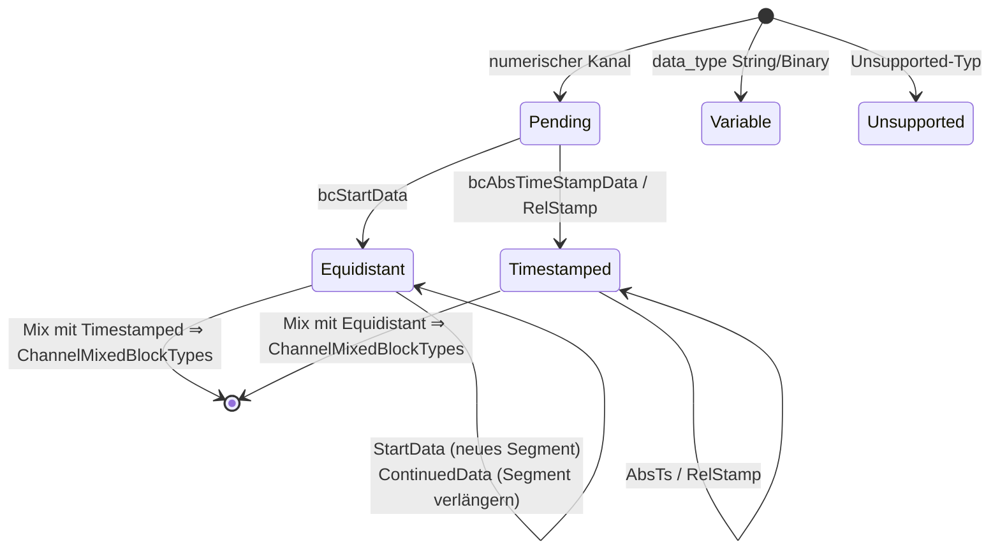

# Interna

Diese Seite beschreibt die privaten Bausteine im `src/`-Verzeichnis
der Bibliothek — relevant für alle, die an ihr mitarbeiten oder ihr
Verhalten bis auf die Byte-Ebene nachvollziehen wollen. Die
Wire-Format-Definitionen selbst stehen in der
[OSF-Spezifikation](../../osf_general.md).

## Übersicht der privaten Bausteine

| Baustein | Dateien | Verwendet von |
|---|---|---|
| Block-Encoder | `blockencode_p.{h,cpp}` | beide Writer |
| Writer-Gemeingut (Chunking, Metablock-Assembly) | `writercommon_p.{h,cpp}` | beide Writer |
| Durable Datei-I/O | `durablefile_p.{h,cpp}` | nur `StreamingWriter` |
| Little-Endian-Helfer | `binaryio_p.h` | Encoder |
| Dekompressions-Streambuf | `compression.cpp` (Klasse `DecompressingIStream::Streambuf`) | Lesepfad |
| Builder-Zustandsmaschine | `manager.cpp` (Struct `ChannelBuilder`) | `DataManager` |

## Block-Encoder (`osf::detail::encode_*`)

Der Encoder schreibt komplette Block-Frames
`[u16 Kanalindex][Längenfeld][Payload]` in einen Byte-Vektor
(little-endian durchgehend):

| Funktion | Block | Payload-Layout |
|---|---|---|
| `encode_start_data<T>` | `bcStartData` (6) | `[u8 ctrl][i64 start_ts][f64 rate][u32 N][N × T]` |
| `encode_continued_data<T>` | `bcContinuedData` (5) | `[u8 ctrl][u32 N][N × T]` |
| `encode_abs_timestamp_data<T>` | `bcAbsTimeStampData` (8) | `[u8 ctrl][u32 N][N × (i64 ts + T)]` |
| `encode_abs_timestamp_data_gps` | dito für GPS | Wert = 3 × f64 (lat, lon, alt) = 24 Bytes |
| String-/Binary-Überladungen | dito, Einzel-Sample | `[u8 ctrl][i64 ts][Bytes]` — Bit 7 = 0, **kein** `0x00`-Terminator (OSF5) |

Konventionen: Bit 7 des Control-Bytes wird nur gesetzt, wenn die
Multi-Sample-Form (u32-N-Präfix) benutzt wird; bei `count == 1`
entfällt das Präfix (spart 4 Bytes pro Einzel-Sample-Block,
Spec-Rev 2026-05-24). Die Writer rufen den Encoder ausschließlich mit
vorab via `writercommon_p` berechneten, kapazitätskonformen
Sample-Mengen auf.

## Chunking-Mathematik (`writercommon_p`)

Das Längenfeld eines Blocks ist `sizeOfLengthValue` (2 oder 4) Bytes
breit; daraus ergibt sich die maximale Payload pro Block:

```cpp
maxPayloadForSov(2) == 0xFFFF;                  // 65 535 Bytes
maxPayloadForSov(4) == 0x7FFFFFFF - 1024;       // soft-cap, vermeidet i32-Überlauf
```

Daraus leiten drei Helfer die maximale Sample-Anzahl pro Blocktyp ab
(Overhead: `bcStartData` 21 Bytes = ctrl + ts + rate + N;
`bcContinuedData`/`bcAbsTimeStampData` 5 Bytes = ctrl + N; bei
timestamped zählt jedes Sample 8 Bytes Zeitstempel extra). Für
variable Einzel-Sample-Blöcke gilt
`variableSampleCapacity(sov) = max_payload - 9` (ctrl + ts).
Diese Funktionen sind die **einzige** Stelle, an der Blockgrößen
berechnet werden — Streaming- und Block-Writer chunken damit identisch.

`buildMetablock(FileInfoDraft, ChannelDefs)` setzt den OSF5-Metablock
zusammen: Indizes sequenziell 0..N, `channeltype` normalisiert
(`equidistant` bleibt, alles andere wird `scalar` — die etablierte
Konvention der OSF-Referenzdateien), und die automatischen
Metadaten-Defaults werden angewendet (`created_utc` = aktuelle UTC-Zeit als
`YYYY-MM-DDTHH:MM:SSZ`, `creator`-Fallback `osf-cpp/<version>`,
`tag`-Fallback `default`; `reason`/GPS-Tripel bleiben weggelassen
statt `null`).

## `DurableFile` — fsync-Semantik des Streaming-Writers

RAII-Wrapper um einen nativen Datei-Handle mit drei Operationen:
`write` (vollständig oder Fehler), `force` (Windows:
`FlushFileBuffers`, POSIX: `fsync`) und `close`. Der
`StreamingWriter` ruft nach jedem Block `force` — deshalb ist „Aufruf
kehrt erfolgreich zurück" gleichbedeutend mit „Block ist auf dem
Medium". Fehler aus `write`/`force` setzen den Writer in den
`Broken`-Zustand (Sticky Error).

## Dekompressions-Streambuf (Lesepfad)

`DecompressingIStream` versteckt einen custom `std::streambuf` hinter
einem PIMPL, damit der öffentliche Header zlib-frei bleibt:

- Klassifikation über die ersten zwei Bytes (`detectCompression`,
  nicht-konsumierend via read + seek-back — die Quelle muss seekbar
  sein).
- `underflow()` inflatet on demand in einen festen Puffer —
  konstanter Speicher unabhängig von der Dateigröße.
- `inflateInit2(MAX_WBITS | 32)` aktiviert die automatische
  gzip/zlib-Header-Erkennung von zlib selbst.
- Trunkierte komprimierte Ströme liefern EOF statt eines Fehlers
  (Best-Effort, konsistent mit dem restlichen Lesepfad).
- Bei `CompressionFormat::None` werden die Bytes 1:1 durchgereicht —
  `DataManager` kann die Fassade deshalb bedingungslos vorschalten.

## Builder-Zustandsmaschine (`DataManager`)

Pro Kanal hält `manager.cpp` einen `ChannelBuilder` mit fünf
Zuständen:



Regeln, die die Übergänge erzwingen (alle mit Tests abgedeckt):

- `bcContinuedData` im Zustand `Pending` ⇒ `ContinuedDataWithoutStart`.
- `bcContinuedRelStampData` ohne vorherigen absoluten Zeitstempel ⇒
  `RelStampWithoutAnchor`; sonst werden die u32-Deltas mit dem letzten
  absoluten Zeitstempel als Anker aufsummiert.
- Payload-Datentyp ≠ Kanal-Datentyp ⇒ `DataTypeMismatch`.
- `Unsupported`-Kanäle konsumieren ihre Blöcke (Reader-seitig schon
  `Skipped`) und werden bei `finalize` aus der Kanalliste gelassen.

`finalize_builder` übersetzt den Endzustand in die passende
`DataChannel`-Variante; `Pending` ohne jeden Block wird als leerer
Kanal des deklarierten Typs materialisiert.

## Reader-Details

- Byte-Dekodierung über kleine `le_u16`/`le_u32`/`le_u64`-Helfer (plus
  signed/float-Überladungen) statt `reinterpret_cast` — frei von
  Alignment- und Endianness-Annahmen.
- `PayloadCursor` läuft über die im Speicher liegende Block-Payload
  und liefert `std::optional<T>`; ein Überlauf wird so zum sauberen
  `InvalidBlock` statt zu UB.
- Multi-Sample-String/Binary-Blöcke (Bit 7 gesetzt) werden per
  Gleichlängen-Split zerlegt; bei nicht teilbarer Länge fällt der
  Reader auf Einzel-Sample zurück.
- Der Null-Terminator wird versions-deterministisch behandelt
  (Feld `osf_version_` im Reader): OSF4 strippt das letzte Byte jeder
  String-/Binary-Payload, OSF5 nie (Spec-Rev 2026-05-24).
- Der optionale OSF4-`0xFFFF`-Infoblock und der 40-Byte-Trailer
  (`OSF_STREAM_END …`) werden konsumiert und nie als `Block`
  ausgeliefert.

## Test-Layout und Verifikation

| Ebene | Ort | Charakter |
|---|---|---|
| Unit | `tests/unit/test_*.cpp` | synthetische Bytes/Strukturen, eine Datei pro Modul |
| Integration | `tests/integration/*_examples.cpp` | echte Dateien aus `examples/` (Felddaten + 17 generierte Referenzdateien) |
| Round-Trip | `tests/integration/roundtrip_helper.hpp` | Laden → Schreiben → Reload → **bitgenauer** Sample-Vergleich |
| C-ABI | `tests/c_api/test_c_api.c` | eigenständiges C99-Programm, beweist C-Linkage |

Vor jedem Push gilt: kompletter ctest-Lauf lokal grün (aktuell 321
Tests mit `OSF_BUILD_C_API=ON`), 0 Warnungen; CI verifiziert
zusätzlich GCC/AppleClang/MSVC mit `-Werror`/`/WX`.

## Einen neuen Datentyp ergänzen (Checkliste)

Falls eine künftige Spec-Revision einen Datentyp hinzufügt:

1. `types.h/cpp` — Enumerator + Wire-Spelling in `parseDataType`.
2. `block.h` — Payload-Varianten (`NumericPayload`,
   `TimestampedPayload`, ggf. `RelTimestampedPayload`) erweitern.
3. `reader.cpp` — Dekoder-Zweig (Sample-Größe, Payload-Parser).
4. `datachannel.h/cpp` — `NumericValues`, Flat-Accessor-Makro,
   `numericValuesEmptyFor`.
5. `manager.cpp` — `*PayloadDataType`-Visitor erweitern.
6. `blockencode_p` + Writer — Encoder-Instanziierung,
   `IsTimestampedNumeric`-Spezialisierung in beiden Writer-Headern.
7. `capi` — ggf. `osf_data_type` + Konvertierungs-Reader.
8. Tests auf jeder Ebene; Referenzdateien im Generator ergänzen.

Dass die Liste lang ist, ist Absicht: Jede Schicht ist explizit
typisiert, nichts wird über `void*` oder Laufzeit-Casts geschleust.
