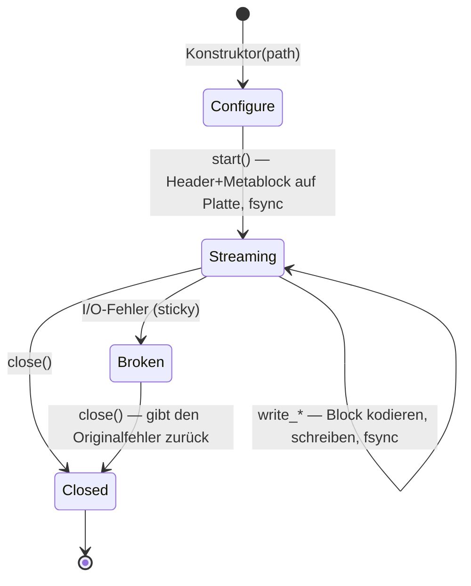

# Schreiben

Die Bibliothek schreibt **ausschließlich OSF5** — auch
dann, wenn die Quelle eine OSF4-Datei war. Zwei Writer-Klassen decken
zwei sehr unterschiedliche Einsatzprofile ab:

| | `StreamingWriter` | `BlockWriter` |
|---|---|---|
| Einsatz | Embedded-Aufzeichnung | Analyse, Konvertierung, Export |
| Speicher | konstant (Scratch-Puffer) | sammelt alle Samples im RAM |
| Durabilität | `fsync` pro Block — ausfallsicher bei Stromverlust | kein fsync; Datei entsteht am Ende |
| Senke | Dateipfad | Dateipfad **oder** `std::ostream` (Memory, Socket) |
| `sizeOfLengthValue` | fix ab `start()` (Metablock liegt auf Platte) | automatischer Bump 2 → 4 bei Bedarf |
| Lebenszyklus | Configure → `start()` → Schreiben → `close()` | Sammeln → `writeToFile()` / `writeTo()` (beliebig oft) |
| Mehrfach-Emission | nein (eine Datei pro Instanz) | ja (`writeTo*` ist `const`) |

Beide teilen sich die Kanal-Beschreibung `osf::ChannelDef` und dieselben
Schreibfamilien (äquidistant, timestamped numerisch, GPS, String/Binary).

## Kanäle deklarieren — `ChannelDef`

```cpp
osf::ChannelDef def;
def.name             = "motor.drehzahl";         // Pflicht
def.dataType         = osf::DataType::Double;    // Pflicht
def.channelType      = osf::ChannelType::Scalar; // Pflicht (Scalar = Konvention)
def.sizeOfLengthValue = 2;                       // 2 (Standard) oder 4
def.physicalUnit     = "1/min";                  // optional
def.displayName      = "Motordrehzahl";          // optional
// ferner: physicalDimension, mimeType, reference, comment, timeIncrementNs
```

`addChannel(def)` liefert den Kanalindex (sequenziell ab 0), den alle
Schreibaufrufe verwenden. Abgelehnt werden (`InvalidArgument`):
`sizeOfLengthValue` ≠ 2/4, `Unsupported`-Typen, mehr als 65535
Kanäle — beim `StreamingWriter` zusätzlich jeder Aufruf nach `start()`.

### `sizeOfLengthValue` richtig wählen

Das Längenfeld jedes Blocks ist 2 oder 4 Bytes breit und begrenzt die
Blockgröße (~64 KB bzw. ~2 GB). Praktische Regeln:

- **String/Binary-Kanäle mit großen Samples** (Bilder, Audio, Blobs):
  beim `StreamingWriter` zwingend `4` deklarieren — er kann den Wert
  nach `start()` nicht mehr ändern und lehnt zu große Samples mit
  `InvalidBlock` ab. Der `BlockWriter` hebt selbst an (Bump 2 → 4 beim
  Emit), dort ist `2` als Startwert immer in Ordnung.
- **Hochratige numerische Kanäle** am `StreamingWriter`: `4` erspart
  Chunking — ein 100k-Sample-`double`-Append in einen `sov=2`-Kanal
  zerfällt sonst in ~13 Blöcke = ~13 fsyncs.
- Sonst: beim Standard `2` bleiben (kompaktere Blöcke).

## `StreamingWriter` — embedded, ausfallsicher

### Lebenszyklus



```cpp
#include <osf/streamingwriter.h>

osf::StreamingWriter w("aufzeichnung.osf");
w.setCreator("logger-fw/3.2");                 // Metadaten vor start()
w.setTag("pruefstand-7");

auto rpm = w.addChannel(rpm_def);              // Result<uint16_t>
auto gps = w.addChannel(gps_def);
if (!rpm || !gps) { /* … */ }

if (auto r = w.start(); !r) { /* Datei offen, Metablock geschrieben */ }

// Aufzeichnungsschleife
while (running) {
    auto r = w.writeTimestampedSample<double>(*rpm, now_ns(), read_rpm());
    if (!r) { /* I/O-Fehler => Writer ist Broken; abbrechen */ break; }
}

if (auto r = w.close(); !r) { /* … */ }
```

Garantien und Verhalten:

- **Jeder erfolgreich zurückgekehrte `write_*` ist auf Platte**
  (`FlushFileBuffers` unter Windows, `fsync` unter POSIX). Nach
  Stromausfall ist die Datei bis zum letzten bestätigten Block lesbar —
  der Reader ist auf genau dieses Szenario ausgelegt (Best-Effort bei
  Trunkierung).
- **Sticky Error:** Nach einem I/O-Fehler wechselt der Writer in den
  Zustand `Broken`; jeder weitere Aufruf (auch `close()`) gibt den
  ursprünglichen Fehler zurück. So geht die Fehlerursache in
  Fire-and-forget-Schleifen nicht verloren.
- **Metadaten-Setter nur vor `start()`** wirksam — der Metablock wird
  von `start()` geschrieben und nie wieder angefasst.
- **Kein OSFZ:** Der Streaming-Writer schreibt rohe `.osf`-Dateien.
  Kompression ist ein nachgelagerter Schritt — Schreib- und
  Kompressions-Fehlermodi bleiben so entkoppelt.
- Move-konstruier-/zuweisbar, nicht kopierbar. Nicht thread-safe —
  Zugriffe extern serialisieren.
- Der Scratch-Puffer wächst auf die Größe des größten je geschriebenen
  Blocks und wird erst im Destruktor freigegeben.

### Schreibfamilien

```cpp
// Äquidistant (nur float/double per Spec) — Segment öffnen + verlängern:
w.startEquidistantSegment(ch, t0_ns, 1000.0 /*Hz*/, daten.data(), daten.size());
w.appendEquidistantSamples(ch, weitere.data(), weitere.size());   // braucht offenes Segment

// Timestamped numerisch (11 Typen, Template):
w.writeTimestampedSample<std::int32_t>(ch, ts_ns, wert);
w.writeTimestampedSamples<double>(ch, ts_array, werte, n);        // parallele Arrays

// GPS (eigene Symbole, kein Template):
w.writeTimestampedGpsSample(ch, ts_ns, osf::GpsLocation{lat, lon, alt});

// String/Binary (ein Sample pro Block per Spec; OSF5: kein 0x00-Terminator):
w.writeTimestampedString(ch, ts_ns, "Ereignis: Tür offen");
w.writeTimestampedBinary(ch, ts_ns, osf::BinarySample::fromVector(jpeg_bytes));
```

Jeder Mehr-Sample-Aufruf wird automatisch auf die Blockkapazität des
Kanals gechunkt (ein fsync pro Block). Ein neues
`startEquidistantSegment` öffnet bewusst ein **neues** Segment —
Lücken zwischen Segmenten sind das spec-gemäße Mittel, um
Aufzeichnungspausen darzustellen.

## `BlockWriter` — sammeln und emittieren

```cpp
#include <osf/blockwriter.h>

osf::BlockWriter w;
w.setCreator("analyse-tool/1.0");

auto ch = w.addChannel(def);
w.addEquidistantSegment(*ch, t0_ns, 100.0, samples.data(), samples.size());
w.addTimestampedSample<double>(*ev, ts_ns, 42.0);
w.addStringSample(*log, ts_ns, "Kalibrierung ok");

if (auto r = w.writeToFile("ergebnis.osf"); !r) { /* … */ }

std::ostringstream mem;                 // oder in einen beliebigen ostream
if (auto r = w.writeTo(mem); !r) { /* … */ }
```

- Die `add*`-Familie spiegelt die `write*`-Familie des
  Streaming-Writers (gleiche Typen, gleiche Validierung), sammelt aber
  nur im Speicher; Chunking in spec-konforme Blöcke passiert beim Emit.
- `writeToFile` / `writeTo` sind **`const`** — dieselbe Instanz darf
  mehrfach emittiert werden (z. B. Datei + Netzwerk).
- **Auto-Bump:** Variable Kanäle, deren größtes Sample nicht in das
  deklarierte u16-Längenfeld passt, bekommen für die Emission
  `sizeOfLengthValue = 4`.
- Kein fsync — Durabilität liegt beim Aufrufer.
- `channelIndex("name")` und `channelCount()` helfen, wenn die
  Indizes nicht mitgeführt werden.

## Automatische Metadaten-Defaults

Beide Writer wenden beim Zusammenbau des Metablocks dieselben
Defaults an:

| Feld | Verhalten wenn nicht gesetzt |
|---|---|
| `createdUtc` | **immer** automatisch gestempelt (aktuelle UTC-Zeit, `YYYY-MM-DDTHH:MM:SSZ`; der On-Disk-JSON-Schlüssel lautet `created_utc`) |
| `creator` | `osf-cpp/<Bibliotheksversion>` |
| `tag` | `default` |
| `reason`, `createdAt*`, `namespaceSep`, `comment` | weggelassen (nicht als `null` geschrieben, wenn nicht gesetzt) |

## `StaleValueGuard` — inaktive Kanäle frisch halten

Sporadische (Event-)Kanäle bekommen nur bei Wertänderung ein Sample.
Auf einem Zeitstrahl ist ein vor Stunden zuletzt geschriebener Kanal
mehrdeutig: Gilt der Wert noch, oder ist die Aufzeichnung tot? Die
optiMEAS-Konvention begrenzt diese „Staleness", indem der letzte Wert
spätestens alle 100 s wiederholt wird. Genau das automatisiert der
Guard als Write-Through-Wrapper über einem gestarteten
`StreamingWriter`:

```cpp
#include <osf/stalevalueguard.h>

osf::StreamingWriter w(path);
/* … konfigurieren, start() … */
osf::StaleValueGuard guard(w);                  // Default: 100 s; eigener Wert möglich

// Timestamped-Writes durch den Guard routen (cached den letzten Wert):
guard.writeTimestampedSample<double>(temp_ch, ts_ns, 21.5);

// Periodisch (z. B. im Aufzeichnungs-Tick):
auto reemitted = guard.poll(now_ns);            // Result<std::size_t>
```

Eigenschaften:

- **Pull-basiert:** kein interner Thread, keine eigene Uhr — der
  Aufrufer liefert `now_ns` an `poll()`. Deterministisch und
  embedded-tauglich.
- Pro `poll()` höchstens **eine** Wiederholung je Kanal (kein
  Backfill der Lücke).
- Nur numerische + GPS-Kanäle; String/Binary bewusst nicht (große
  Blobs wiederholen wäre kontraproduktiv).
- Kanäle werden beim ersten Write-Through automatisch erfasst;
  `isTracked` / `forget` / `clear` steuern das Tracking.
- Echte Writes setzen die Inaktivitätsuhr zurück — aktiv beschriebene
  Kanäle bekommen nie eine synthetische Wiederholung.

## Round-Trip und Konvertierung

Einen geladenen `DataManager` wieder herausschreiben (auch als
OSF4 → OSF5-Konvertierung):

```cpp
#include <osf/manager.h>
#include <osf/blockwriter.h>

auto mgr = osf::DataManager::loadFromFile("alt.osf");      // auch OSF4 / OSFZ
if (!mgr) { /* … */ }

if (auto r = osf::writeToFile(*mgr, "neu.osf"); !r) { /* … */ }   // immer OSF5
```

Intern baut `BlockWriter::fromManager(mgr)` einen Writer aus den
typisierten Kanälen; wer vor dem Schreiben filtern oder umbenennen
will, benutzt `fromManager` direkt und arbeitet auf dem Writer.

Erhalten bleiben: Kanalnamen, Datentypen, Sample-Werte (bitgenau),
Segmentgrenzen, Datei-Metadaten (außer `created_utc`, das beim
Schreiben neu gestempelt wird). **Nicht** erhalten bleibt der
Kanalindex — der Writer vergibt sequenziell 0..N neu.

## Was die Writer bewusst nicht tun

- **Kein OSF4-Output** — OSF5 ist das einzige Schreibformat.
- **Kein OSFZ-Output** — Kompression ist nachgelagert;
  ein Post-Close-Kompressor und ein `osf-compress`-CLI sind als
  Folgearbeit entworfen.
- **Kein `bcContinuedRelStampData`** — das relative Zeitformat ist
  OSF4-Lesealtbestand; Writer emittieren absolute Zeitstempel.
- **Keine Zeitstempel-Validierung** — Monotonie ist laut Spec nicht
  gefordert und wird nicht erzwungen.
