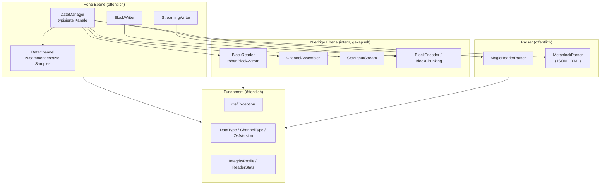
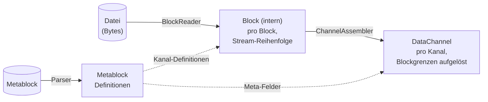

# Architektur der Java-Implementierung

Diese Seite beschreibt den inneren Aufbau der Java-Implementierung:
das Schichtenmodell, die Module und ihr Zusammenspiel, das Datenmodell
und die zentralen Designentscheidungen. Sie richtet sich an Entwickler,
die die Bibliothek einbinden **und** an solche, die daran mitarbeiten
wollen. Einen schnellen Überblick gibt die
[Übersichtsseite](../java.md); die Detail-Themen Lesen, Schreiben,
Fehlerbehandlung, Werkzeuge und Build haben eigene Seiten.

## Leitlinien

Die Implementierung folgt vier Grundsätzen:

1. **Modernes, eigenständiges Java 21.** Idiomatisches Java auf dem
   aktuellen LTS-Stand — Records, versiegelte Typen, `switch`-Pattern —
   ohne Fremdsprach-Brücken. Das Verhalten ist allein durch die
   OSF-Format-Spezifikation definiert, nicht durch eine Referenz-Portierung.
2. **Strikte Kapselung über JPMS.** Der Java-Platform-Module-System-Deskriptor
   exportiert ausschließlich `com.optimeas.osf`; das interne Paket
   `com.optimeas.osf.internal` bleibt auch gegen Reflection verschlossen.
   Die öffentliche Fläche ist damit klein und stabil.
3. **Best-Effort beim Lesen.** Abgeschnittene Dateien (Stromausfall
   beim Embedded-Schreiber) liefern alle vollständig lesbaren Blöcke
   statt eines Fehlers; unbekannte zukünftige Datentypen werden
   übersprungen statt das Laden abzubrechen.
4. **Schlanke, gängige Abhängigkeiten.** Jackson für das OSF5-JSON,
   die in der JDK enthaltene StAX-API für das OSF4-XML,
   `java.util.zip` (OSFZ-Dekompression + CRC32C) und SLF4J als
   Logging-Fassade. Keine schweren Frameworks.

## Schichtenmodell



Die meisten Anwendungen arbeiten ausschließlich auf der hohen Ebene
(`DataManager` zum Lesen, einer der beiden Writer zum Schreiben). Die
niedrige Ebene — Block-Reader, Kanal-Assembler, OSFZ-Strom, Encoder —
liegt im gekapselten Paket `com.optimeas.osf.internal` und ist von
außen unsichtbar; die Lesepipeline wird komplett vom `DataManager`
orchestriert.

## Module und Verantwortlichkeiten

Der Maven-Reaktor `com.optimeas.osf:osf-parent` fasst drei Module zusammen:

| Modul | Artefakt | Rolle |
|---|---|---|
| Kernbibliothek | `com.optimeas.osf:osf-java` | Lesen (OSF4 + OSF5 + OSFZ), beide OSF5-Writer, das Integritätsprofil `crc` |
| Kommandozeile | `osf-cli` | Inspektion und Konvertierung von OSF-Dateien; ausführbares Jar |
| Betrachter | `osf-viewer` | JavaFX-Anwendung zur mehrkanaligen Signalanzeige |

Diese Seite beschreibt das Kernmodul. Die öffentliche Fläche des Kerns
(Paket `com.optimeas.osf`):

| Typ | Inhalt | Schicht |
|---|---|---|
| `DataManager` | Laden + typisierte Kanalliste + Telemetrie | Hoch |
| `DataChannel` | zusammengesetzte Samples eines Kanals; `Kind`, `Segment` | Hoch |
| `StreamingWriter` | ausfallsicherer OSF5-Writer (`fsync` pro Block) | Hoch |
| `BlockWriter` | im Speicher sammelnder OSF5-Writer; `fromManager` | Hoch |
| `MagicHeader` / `MagicHeaderParser` | Magic-Header-Zeile + Integritäts-Token | Parser |
| `Metablock` / `MetablockParser` / `ChannelDef` | Definitionen; JSON- **und** XML-Parser | Parser |
| `DataType` / `ChannelType` | Wire-Enums + `fromWireName` | Fundament |
| `OsfVersion` | On-Disk-Version (OSF4 / OSF5) | Fundament |
| `GpsLocation` | GPS-Sample (Record: `latitude`/`longitude`/`altitude`) | Fundament |
| `IntegrityProfile` | Integritätsstufe (`NONE` / `CRC32C` / `ED25519`) | Fundament |
| `ReaderStats` | Lese-Telemetrie (Blöcke, Trunkierung, Kompression) | Fundament |
| `OsfException` | Ausnahme-Hierarchie (siehe unten) | Fundament |

Interne Bausteine (Paket `com.optimeas.osf.internal`, **nicht** exportiert):
`BlockReader` + `Block` (roher Block-Strom), `ChannelAssembler`
(Block → Kanal), `OsfzInputStream` (transparente OSFZ-Dekompression),
`BlockEncoder` + `BlockChunking` (OSF5-Block-Encoder + Chunking-Mathematik),
`Integrity` (CRC32C-Rahmen), `MetablockBuilder`, `JsonMetablockParser` /
`XmlMetablockParser` und `LittleEndian` (Byte-Order-Helfer).
Details siehe [Interna](internals.md).

## JPMS-Kapselung

Der Moduldeskriptor `module-info.java` zieht eine harte Grenze:

```
module com.optimeas.osf {
    requires com.fasterxml.jackson.databind;
    requires org.slf4j;
    requires java.xml;          // StAX für den OSF4-XML-Metablock

    exports com.optimeas.osf;
    // com.optimeas.osf.internal ist bewusst NICHT exportiert.
}
```

Nur `com.optimeas.osf` ist exportiert. Das interne Paket ist auf zwei
Ebenen gekapselt: Der Compiler verweigert den Zugriff auf nicht
exportierte Typen, und — weil es kein `opens` gibt — bleibt es auch
zur Laufzeit gegen Reflection verschlossen. Anwendungscode kann die
internen Klassen also weder importieren noch reflektiv adressieren.

Das hat eine sichtbare Konsequenz im Datenmodell: `DataChannel` besitzt
zwar einen nominell `public`-Konstruktor für den `ChannelAssembler`,
doch dessen Parametertyp (`Block.Values`) liegt im internen Paket. Von
außerhalb des Moduls lässt sich der Konstruktor damit nicht aufrufen —
`DataChannel`-Instanzen entstehen ausschließlich über den `DataManager`.

## Drei Datenmodelle — wer sieht was

Die Bibliothek hat bewusst drei Repräsentationen derselben Daten, je
nach Abstraktionsebene:



1. **`Metablock`** (`MetablockParser`) — die *Definitionen*:
   Datei-Metadaten (`Map<String,String>`) und Kanal-Definitionen
   (`ChannelDef`). OSF4 (XML, via StAX) und OSF5 (JSON, via Jackson)
   unterscheiden sich nur in der Serialisierung; beide Parser füllen
   dasselbe Modell symmetrisch.
2. **`Block`** (intern) — die *Stream-Sicht*: ein dekodierter Block mit
   Kanalindex und Block-Kind (`bcStartData`, `bcContinuedData`,
   `bcAbsTimeStampData`, `bcContinuedRelStampData`). Payloads liegen als
   ausgepackte, typisierte `Block.Values`-Records vor, damit keine
   Datentyp-Information verlorengeht. Dieses Modell ist gekapselt und
   erscheint nie in der öffentlichen API.
3. **`DataChannel`** — die *Kanal-Sicht*: pro Kanal ein flacher
   Sample-Lauf mit parallelen absoluten Timestamps, die Blockgrenzen
   sind aufgelöst. Ein einziger Klassentyp, dessen Speicher-Layout ein
   `Kind`-Diskriminator unterscheidet:

   | `Kind` | Speicherung |
   |---|---|
   | `EQUIDISTANT` | flacher Sample-Lauf + `List<Segment>`; Timestamps rekonstruiert |
   | `TIMESTAMPED` | numerisch/GPS mit expliziten parallelen Timestamps |
   | `VARIABLE` | String- **oder** Binary-Samples, stets timestamped |

**Namenshinweis:** `ChannelDef` ist die *Kanal-Definition* aus dem
Metablock; `DataChannel` sind die *zusammengesetzten Samples*. Die
typisierten Accessoren `asDoubles()`, `asLongs()`, `asBooleans()`,
`asStrings()`, `asBinaries()` und `asGps()` projizieren den gespeicherten
Lauf; passt der `dataType()` nicht zur angeforderten Sicht, wirft der
Accessor `OsfException.UnsupportedType`.

## Namens- und API-Konventionen

- **Typen** in PascalCase (`DataManager`, `BlockWriter`).
- **Methoden und Accessoren** in camelCase **ohne** `get`-Präfix
  (`loadFromFile`, `channelByName`, `timestampsNs`, `asDoubles`);
  Records tragen komponentengleiche Accessoren (`name()`, `index()`).
- **Enum-Konstanten** in UPPER_SNAKE_CASE (`EQUIDISTANT`, `OSF4`,
  `CRC32C`, `GPS_LOCATION`); jedes Wire-Enum trägt die exakte
  Wire-Schreibweise über `wireName()` und wird über die infallible
  Fabrik `fromWireName(String)` aufgelöst.
- **Wertträger** sind, wo unveränderlich, Records (`GpsLocation`,
  `DataChannel.Segment`).
- Fehlbare Operationen werfen aus einer Ausnahme-Hierarchie unter
  `OsfException` (`RuntimeException`); es gibt keine geprüften
  Ausnahmen in der Lese-/Schreib-API.
- Nachschläge liefern `Optional<DataChannel>` (`channelByName`,
  `channelByIndex`) statt `null`.
- Konstruktion über statische Fabriken (`DataManager.loadFromFile`,
  `DataManager.load`, `BlockWriter.fromManager`) oder Builder-artige
  Writer-Konfiguration (`add…Channel` → Samples anhängen → Schreibphase).
- Zeitstempel sind durchgehend `long` **Nanosekunden seit der
  Unix-Epoche (UTC)**; Abtastraten `double` in Hz.

## Zentrale Designentscheidungen

### Kapselung statt breiter API

Die öffentliche Fläche ist bewusst auf ein Paket beschränkt. Der ganze
Lesepfad — Block-Dekodierung, Kanal-Assemblierung, OSFZ-Dekompression,
CRC-Prüfung — liegt hinter `DataManager` und ist über JPMS unerreichbar.
So bleibt die zugesagte API klein, und interne Umbauten brechen keinen
Consumer-Code.

### Best-Effort und Vorwärtskompatibilität

Reale OSF-Dateien entstehen auf Geräten, die jederzeit die
Stromversorgung verlieren können, und mit Spec-Ständen, die der
Leser noch nicht kennt. Daraus folgen drei Verhaltensregeln:

- **Trunkierung ist kein Fehler.** Endet die Datei mitten im Block,
  liefert der Reader alle vollständigen Blöcke und setzt
  `ReaderStats.truncationSeen()` auf `true`, statt zu werfen.
- **Unbekanntes wird toleriert.** Ein unbekannter (zukünftiger)
  Datentyp parst als `DataType.UNSUPPORTED`, ein unbekannter Kanaltyp
  als `ChannelType.UNSUPPORTED`; die Datei lädt weiter und die
  Original-Schreibweise bleibt im `attributes`-Eintrag des Kanals
  erhalten.
- **Entfernte Spec-Elemente sind harte Fehler.** Datentypen, die aus
  der Spezifikation entfernt wurden (`pair`, `triple`, `candata`,
  `gpsdata`), werden mit `OsfException.UnsupportedType` abgelehnt —
  ihr Payload-Layout lässt sich nicht reproduzieren, stilles Raten
  wäre Datenkorruption.

### Zwei Writer statt einem

`StreamingWriter` (Embedded: `fsync` pro Block über `FileChannel.force`,
konstanter Speicher, ausfallsicher) und `BlockWriter` (Analyst: sammelt
im Speicher, emittiert am Ende, kann `sizeoflengthvalue` von 2 auf 4
automatisch anheben) haben unvereinbare Invarianten — ein gemeinsamer
Writer hätte beide Profile verwässert. Beide teilen jedoch dieselbe
Chunking-Mathematik (`BlockChunking`) und erzeugen für identische
Kanäle, Samples, `sizeoflengthvalue` und `created_utc`
**byte-identisches OSF5**. Details auf der Seite [Schreiben](writing.md).

### Transparentes OSFZ nur beim Lesen

OSFZ (= gzip- oder zlib-komprimiertes OSF) wird beim **Lesen**
transparent erkannt und dekomprimiert: `DataManager.load` legt vor dem
Magic-Header-Parse einen `OsfzInputStream` über die Quelle und füllt
`ReaderStats.compressed()` / `compressionFormat()`. Beim **Schreiben**
komprimiert die Bibliothek bewusst nie inline; Kompression ist ein
nachgelagerter Schritt.

### Integritätsprofil `crc`

Trägt der Magic-Header ein `crc32c`-Token, prüft `DataManager.load` die
CRC32C des Metablocks fail-closed gegen den Header-Wert und lehnt bei
Abweichung mit `OsfException.MetablockCrcMismatch` ab; die Block-Rahmen
werden ebenfalls per CRC32C validiert. Signierte Dateien
(`IntegrityProfile.ED25519`) werden transparent gelesen — Signaturblöcke
werden übersprungen und gezählt —, die Signaturen aber nicht verifiziert.

### Thread-Sicherheit

| Klasse | Vertrag |
|---|---|
| `DataManager` (geladen) | unveränderlich → beliebig parallel lesbar |
| `DataChannel` | unveränderlich; die Backing-Arrays nicht mutieren |
| `StreamingWriter` / `BlockWriter` | nicht thread-safe; Aufrufe extern serialisieren |
| verschiedene Writer auf verschiedene Dateien | parallel unproblematisch |

## Verzeichnislayout

```
implementations/java/
├── pom.xml                    — Reaktor (osf-parent), drei Module
├── osf-java/                  — Kernbibliothek
│   ├── pom.xml
│   └── src/main/java/
│       ├── module-info.java   — JPMS-Deskriptor
│       └── com/optimeas/osf/
│           ├── *.java         — öffentliche API-Fläche
│           └── internal/      — gekapselte Bausteine
├── osf-cli/                   — Kommandozeilenwerkzeug (picocli)
└── osf-viewer/                — JavaFX-Betrachter
```

## Weiterführend

- [Lesen — DataManager, DataChannel, OSFZ](reading.md)
- [Schreiben — StreamingWriter, BlockWriter](writing.md)
- [Fehlerbehandlung — OsfException-Hierarchie](error-handling.md)
- [Werkzeuge — osf-cli und osf-viewer](tools.md)
- [Bauen & Einbinden — Maven, JPMS, CI](building.md)
- [Kochbuch — Rezepte für typische Aufgaben](cookbook.md)
- [Interna — Encoder, Chunking, Assembler](internals.md)
- [Format-Spezifikation](../../osf_general.md)

> Dieses Dokument ist lizenziert unter [CC BY 4.0](https://creativecommons.org/licenses/by/4.0/deed.de). Namensnennung: optiMEAS GmbH und optiMEAS Switzerland GmbH.
