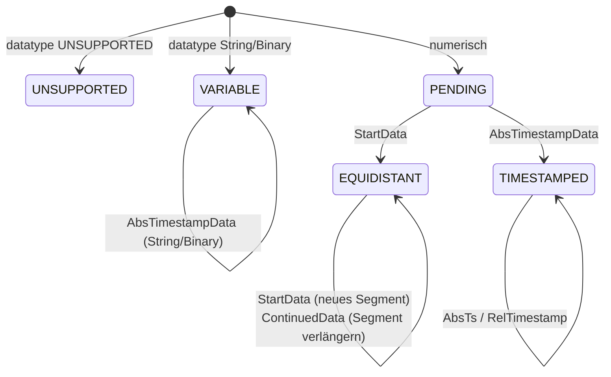

# Interna

Diese Seite beschreibt die privaten Bausteine im gekapselten Paket
`com.optimeas.osf.internal` — relevant für alle, die an der Bibliothek
mitarbeiten oder ihr Verhalten bis auf die Byte-Ebene nachvollziehen
wollen. Die Wire-Format-Definitionen selbst stehen in der
[Format-Spezifikation](../../osf_general.md); den öffentlichen Aufbau
beschreibt die [Architektur](./architecture.md).

## Die „nicht exportiert"-Grenze

Der Moduldeskriptor `module-info.java` exportiert **ausschließlich**
`com.optimeas.osf`. Das Paket `com.optimeas.osf.internal` ist bewusst
**nicht** exportiert und — weil es kein `opens` gibt — auch zur Laufzeit
gegen Reflection verschlossen. Anwendungscode kann diese Klassen weder
importieren noch reflektiv adressieren; sie sind reine
Implementierungsfläche und dürfen ohne API-Bruch umgebaut werden.

| Baustein | Klasse(n) | Verwendet von |
|---|---|---|
| Block-Modell | `Block` (versiegelt) + `Block.Values` | Reader, Assembler |
| Block-Reader | `BlockReader` | `DataManager` |
| Block-Encoder | `BlockEncoder` | beide Writer |
| Chunking-Mathematik | `BlockChunking` | beide Writer |
| Metablock lesen | `JsonMetablockParser`, `XmlMetablockParser` | `DataManager` |
| Metablock schreiben | `MetablockBuilder` | beide Writer |
| Integritäts-Helfer (Schreiben) | `Integrity` | beide Writer |
| Kanal-Assembler | `ChannelAssembler` | `DataManager` |
| OSFZ-Dekompression | `OsfzInputStream` | `DataManager` |
| Byte-Order-Helfer | `LittleEndian` | Reader + Encoder |

Sämtliche Binär-Ein-/Ausgabe läuft über `java.nio.ByteBuffer` /
`FileChannel` mit `ByteOrder.LITTLE_ENDIAN` — es gibt keine
`reinterpret`-artigen Casts und keine Endianness-Annahmen.

## Block-Encoder (`BlockEncoder`)

Der Encoder schreibt einen kompletten OSF5-Block in ein `byte[]`. Der
Rahmen ist durchgehend little-endian:

```
[u16 channelIndex][Längenfeld (sizeOfLengthValue Bytes)][u8 control][body…]
```

Das Längenfeld zählt die Bytes von `control + body`. Das Control-Byte
trägt in Bit 0–6 die Blockart und in Bit 7 (`0x80`) das
Multi-Sample-Flag — gesetzt genau dann, wenn `count != 1`; dann beginnt
der Body mit einem `u32`-Sample-Zähler N, sonst folgt genau ein Sample
ohne N-Präfix.

| Methode | Blockart (Control) | Body |
|---|---|---|
| `timestampedBlock` | `bcAbsTimeStampData` (`0x08`) | je Sample `[i64 ts][Wert]` |
| `timestampedGpsBlock` | `bcAbsTimeStampData` | je Sample `[i64 ts][3 × f64]` (24 B) |
| `startDataBlock` | `bcStartData` (`0x06`) | `[i64 startTs][f64 rate][N?][Werte]` |
| `continuedDataBlock` | `bcContinuedData` (`0x05`) | `[N?][Werte]` |
| `variableStringBlock` / `variableBinaryBlock` | `bcAbsTimeStampData` | Einzel-Sample `[i64 ts][Bytes]` |

`startDataBlock` und `continuedDataBlock` akzeptieren nur `float` /
`double` (`requireFloatOrDouble`, sonst `OsfException.MalformedFile`).
String und Binär werden **ein** Sample pro Block in der kompakten Form
geschrieben (Bit 7 frei, kein N-Präfix), UTF-8 kodiert und **ohne**
abschließendes `0x00` (OSF5); ein enthaltenes `0x00` ist legitimer Inhalt
und bleibt erhalten. `frame(…)` prüft `sizeOfLengthValue ∈ {2, 4}` und
dass die Payload ins Längenfeld passt. Die interne `Body`-Klasse ist ein
kleiner little-endian-Byte-Builder (`u8/u16/u32/i16/i32/i64/f32/f64`);
`f32`/`f64` gehen über `Float.floatToRawIntBits` /
`Double.doubleToRawLongBits`.

`applyFrameCrc(frame, sizeOfLengthValue)` versieht einen fertigen Rahmen
mit dem Integritäts-CRC: Es erhöht das On-Disk-Längenfeld um 4 (damit es
den CRC mitzählt) und hängt die CRC32C über den **ganzen** gepatchten
Rahmen als vier little-endian-Bytes an — genau das, was der Reader
zurückrechnet.

## Chunking-Mathematik (`BlockChunking`)

Diese Klasse ist die **einzige** Stelle, an der Blockgrößen berechnet
werden; weil beide Writer sie aufrufen, chunken sie byte-für-byte
identisch (Grundlage der Byte-Identitäts-Zusage). Aus der Breite des
Längenfelds folgt die maximale Payload:

```java
MAX_PAYLOAD_U16 = 0xFFFF;                 // 2-Byte-Längenfeld
MAX_PAYLOAD_U32 = Integer.MAX_VALUE - 1024;  // Soft-Cap, vermeidet i32-Überlauf
```

Ist das Integritätsprofil aktiv, wird pro Block der Frame-CRC
(`FRAME_CRC_RESERVE = 4` Bytes) im Längenfeld mitgezählt und schmälert
daher das Payload-Budget. Auf diesem Budget leiten drei Helfer die
maximale Sample-Anzahl je Blockart ab (Overhead: `bcAbsTimeStampData`
5 B = ctrl + N und je Sample 8 B Zeitstempel extra; `bcStartData` 21 B =
ctrl + startTs + rate + N; `bcContinuedData` 5 B = ctrl + N):

```java
maxSamplesPerTimestamped(valueSize, sov, frameCrc);  // perSample = 8 + valueSize
maxSamplesPerStart(valueSize, sov, frameCrc);
maxSamplesPerContinued(valueSize, sov, frameCrc);
maxSamplesPerTimestampedGps(sov, frameCrc);          // GPS_VALUE_SIZE = 24
```

Jeder Helfer liefert mindestens 1 (`Math.max(1, …)`), sodass ein einzelnes
übergroßes Sample nie in eine Endlosschleife läuft.

## Integritäts-Helfer (`Integrity`)

Die Schreibseite des OSF5-Integritätsprofils *Stufe crc*. `magicLine`
baut die Magic-Header-Zeile `OSF5 <len>\n` und hängt bei aktivem Profil
ein `crc32c:<HEX8>`-Token an — die CRC32C der Metablock-Bytes als acht
Großbuchstaben-Hexziffern (`hex8`). Damit ist der Metablock im Header
abgesichert; die Frame-CRCs der Datenblöcke liefert `BlockEncoder`.
Sämtliche CRC-Berechnung nutzt `java.util.zip.CRC32C`.

## OSFZ-Dekompressionsstrom (`OsfzInputStream`)

`wrap(in, onFormat)` erkennt gzip/zlib transparent am Stromanfang. Über
einen `PushbackInputStream(in, 2)` werden zwei Bytes vorausgelesen und
klassifiziert:

- **gzip** — `0x1F 0x8B` → `GZIPInputStream`, `onFormat("gzip")`.
- **zlib** — `0x78` gefolgt von `0x01 / 0x5E / 0x9C / 0xDA` →
  `InflaterInputStream`, `onFormat("zlib")`.
- **plain** — alles andere (echtes OSF beginnt mit `'O' = 0x4F`); die
  gelesenen Bytes werden zurückgeschoben und der Strom unverändert
  weitergereicht; `onFormat` wird **nicht** aufgerufen.

Ströme mit weniger als zwei Bytes gelten als plain — der nachgelagerte
Magic-Header-Parser meldet dann den passenden Fehler. Der Callback
speist typischerweise `ReaderStats.setCompression`.

## Metablock-Parser (`JsonMetablockParser` / `XmlMetablockParser`)

Beide Parser füllen dasselbe `Metablock`-Modell (Datei-Metadaten als
`Map<String,String>` plus `ChannelDef`-Liste) symmetrisch:

- **OSF5 / JSON** — `JsonMetablockParser` (Jackson) liest die
  `osf`-Hülle mit `format`, `version`, `file{}` und `channels[]`.
  Pflichtfelder je Kanal: `index` (0..65535), `name`, `channeltype`,
  `datatype`, `sizeoflengthvalue` (muss 2 oder 4 sein). `timeincrement`
  (fehlt/0 ⇒ nicht-äquidistant) und `physicalunit` sind optional;
  restliche skalare String-Felder wandern in die `attributes`-Map.
- **OSF4 / XML** — `XmlMetablockParser` (StAX) liest das
  `<optimeas>`-Wurzelelement mit Datei-Attributen und `<channel>`-Kindern.
  Die `XMLInputFactory` ist **XXE-sicher** konfiguriert
  (`IS_SUPPORTING_EXTERNAL_ENTITIES = false`, `SUPPORT_DTD = false`,
  `IS_REPLACING_ENTITY_REFERENCES = false`); die Version wird auf 4
  gesetzt.

Unbekannte (zukünftige) Datentypen werden zu `DataType.UNSUPPORTED`,
unbekannte Kanaltypen zu `ChannelType.UNSUPPORTED`; die Original-Schreibweise
bleibt im `attributes`-Eintrag erhalten. Aus der Spezifikation entfernte
Datentypen werfen `OsfException.UnsupportedType`. Jackson- bzw.
StAX-Typen erscheinen **nie** in den öffentlichen Model-Records. Die
Schreibseite ist `MetablockBuilder` (baut denselben JSON-Wire-Contract:
`osf.file` verbatim, `osf.channels[]` mit aus der Listenposition neu
abgeleitetem `index`; `timeincrement` nur bei vorhandenem Inkrement).

## Kanal-Assembler (`ChannelAssembler`)

`assemble(channelDefs, blocks)` faltet die flache `List<Block>` mit den
Kanal-Definitionen zu typisierten `DataChannel`s in Metablock-Reihenfolge.
Je Kanal hält ein `Builder` eine Zustandsmaschine:



- `StartData` öffnet ein äquidistantes Segment
  (`Segment(startTs, rate, startIndex, count)`); der erste typisierte
  Block legt das `Kind` fest.
- `ContinuedData` verlängert das jeweils letzte Segment.
- `AbsTimestampData` hängt an ein `TIMESTAMPED`- (numerisch/GPS) bzw.
  `VARIABLE`-Layout (String/Binary) an und aktualisiert den Anker
  (`lastTimestampNs`).
- `RelTimestampData` verlängert nur einen `TIMESTAMPED`-Kanal mit Anker:
  jedes Delta wird per `saturatingAdd` kumulativ auf den letzten
  absoluten Zeitstempel addiert.
- Äquidistante Timestamps werden je Segment als
  `start + (long)(i * 1e9 / rate)` (sättigende Addition) rekonstruiert;
  Lücken zwischen Segmenten werden nicht interpoliert.

Der Assembler ist bewusst nachsichtig: Ein blockfremder Typ auf einem
bereits festgelegten Kanal wird ignoriert statt als Fehler behandelt
(Best-Effort). `finish()` verwirft `UNSUPPORTED`-Kanäle (`null`) und
materialisiert ein `PENDING` ohne jeden Block als leeren äquidistanten
Kanal. Die Wert-Chunks (einer pro Block) werden erst am Ende zu einem
flachen Array je Java-Primitiv konkateniert — Assemblierung bleibt so
O(Gesamt-Samples).

## Byte-Order-Helfer (`LittleEndian`)

Ein winziges, aber zentrales Modul: `wrap(byte[])` und `allocate(int)`
liefern einen `ByteBuffer` mit `ByteOrder.LITTLE_ENDIAN`. Es ist der
**einzige** Ort der Byte-Order-Festlegung; Reader und Encoder gehen
ausnahmslos hierüber, sodass die Endianness an keiner anderen Stelle
wiederholt werden muss.

## Test-Layout und Verifikation

Getestet wird mit **JUnit** unter
`osf-java/src/test/java/com/optimeas/osf/`:

| Ebene | Ort | Charakter |
|---|---|---|
| Unit (intern) | `…/internal/*Test.java` | synthetische Bytes, eine Datei je Baustein (`BlockEncoderTest`, `BlockReaderTest`, `JsonMetablockParserTest`, `XmlMetablockParserTest`, `MetablockBuilderTest`, `LittleEndianTest`, `OsfzInputStreamTest`, `FrameCrcCheckValueTest`) |
| Öffentliche API | `…/*Test.java` | `DataManagerTest`, `BlockWriterTest`, `StreamingWriterTest`, `MagicHeaderParserTest`, `IntegrityReaderTest`, `WriterIntegrityTest` |
| Beispiele / Round-Trip | `*ExamplesTest`, `Roundtrip…` | echte Dateien aus `examples/` (Felddaten + Referenzsatz), inkl. `OsfzExamplesTest` |
| Byte-Identität | `WriterIdentityTest` | beide Writer erzeugen für gleiche Eingabe dasselbe OSF5 |
| Konformanz | `ConformanceManifestTest` | gemeinsames `reference_manifest.json` |
| Robustheit | `FuzzTruncationTest` | trunkierte / verstümmelte Eingaben lösen nie eine unerwartete Ausnahme aus |

Der komplette Lauf erfolgt über
`mvn -f implementations/java/pom.xml test`; die CI führt ihn auf jedem
Push aus. Vollständiger Quelltext des internen Pakets:
[`osf-java/src/main/java/com/optimeas/osf/internal/`](https://github.com/optimeas/osf/tree/main/implementations/java/osf-java/src/main/java/com/optimeas/osf/internal).

## Weiter

- [Architektur](./architecture.md) — Schichtenmodell und Datenmodelle.
- [Lesen](./reading.md) und [Schreiben](./writing.md) — die öffentliche API.
- [Fehlerbehandlung](./error-handling.md) — die `OsfException`-Hierarchie.
- [Werkzeuge](./tools.md) und [Bauen](./building.md).
- [Kochbuch](./cookbook.md) — kopierbare Rezepte.
- [Zurück zur Java-Übersicht](../java.md).

> Dieses Dokument ist lizenziert unter [CC BY 4.0](https://creativecommons.org/licenses/by/4.0/deed.de). Namensnennung: optiMEAS GmbH und optiMEAS Switzerland GmbH.
