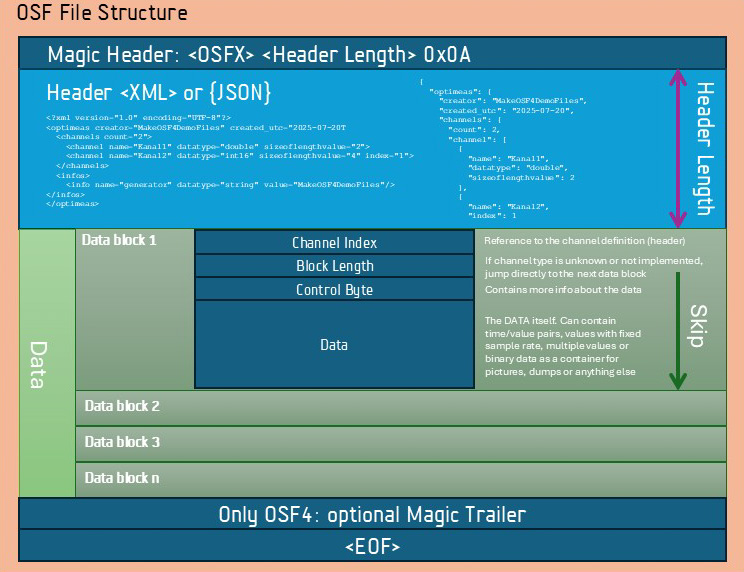

🇬🇧 [English version](../en/index.md)

## Das OSF-Format – Einleitung

OSF ist als universelles Streaming-Format für Mess- und Prozessdaten konzipiert. Es beantwortet die wesentlichen Fragen moderner Datenerfassung: Wie lassen sich kontinuierlich strömende Daten verlustfrei speichern? Wie bleibt das Format offen und erweiterbar, ohne unnötige Komplexität? Und wie verbindet man die Anforderungen von Embedded-Systemen mit der Effizienz leistungsfähiger Analyseplattformen?

Aktuell liegt OSF in der Version 4 vor, während Version 5 sich in der Implementierung befindet. Obwohl sich OSF4 und OSF5 nur in wenigen Punkten unterscheiden, haben wir uns bewusst für einen Versionssprung entschieden: Vor allem der Umstieg auf ein neues Header-Format (JSON als Standard) und die vereinfachte Handhabung des Steuerbytes in den Daten rechtfertigen diese neue Hauptversion. Gleichzeitig bleibt OSF5 vollständig abwärtskompatibel zu OSF4 und kann dessen Dateien – bis auf wenige Detailunterschiede – ohne Einschränkungen lesen und verarbeiten.

### Was OSF im praktischen Einsatz leistet

OSF ist entwickelt für die Realität moderner Messsysteme: Datenströme, die kontinuierlich fließen, schnell erfasst und sicher gespeichert werden müssen. Dabei steht eines im Mittelpunkt: lückenlose Aufzeichnung ohne Datenverlust, selbst wenn Systeme abrupt herunterfahren oder die Stromversorgung unterbrochen wird.

Doch OSF endet nicht beim Schreiben: Es ist ebenso für die **weiterführende Verarbeitung optimiert.** Statt einzelne Werte nacheinander zu speichern, legt OSF Daten blockweise ab. Das ermöglicht:

-   **effizientes und schnelles Speichern** selbst bei hohen Datenraten,
-   **schnelles Laden und Auswerten** großer Datenmengen,
-   konsistente Strukturen, die sowohl auf Embedded-Systemen als auch auf Analyseplattformen performant funktionieren.

### Vorteile auf einen Blick:

-   **Verlustfreie, kontinuierliche Datenaufzeichnung** auf Embedded-Geräten.
-   **Robustheit** gegen Stromausfall oder unerwartetes Abschalten.
-   **Effiziente Blockstruktur** für schnelles Speichern und Laden.
-   **Flexibel** für alle zeitbezogenen Daten: Einzelwerte, Vektoren, Matrizen, Bilder und Audiodaten.
-   **Offen und einfach zu implementieren** mit klarer Struktur.
-   **Einheitlich** – ein Format für Edge, Labor und Cloud.

OSF ist damit nicht nur ein Speicherformat, sondern ein Werkzeug, um **Datenströme verlustfrei und effizient über ihren gesamten Lebenszyklus** zu begleiten – vom ersten Messwert bis zur Analyse.

## Eine offene Lösung für zeitbezogene Daten

Die Antwort von OSF auf diese Anforderungen ist eine klare, offene Struktur, die für **OSF4** und **OSF5** gleichermaßen gilt:

-   **Magic Header** zur Identifikation und schnellen Verarbeitung.
-   **Metablock (XML oder JSON)** zur Beschreibung von Kanälen, Datentypen und Kontextinformationen.
-   **Binäre Datenblöcke** für kontinuierliches, robustes Streaming.
-   **Blockorientierte Speicherung**, um große Daten effizient zu schreiben und schnell wieder zu laden.

### Grundsätzliche OSF Dateistruktur

Die Kernarchitektur ermöglicht es, alle zeitbezogenen Daten in einer einzigen, konsistenten Format abzulegen. OSF ist **offen dokumentiert**, leicht zu implementieren und von Edge-Geräten bis zur Cloud skalierbar.

### Was bei OSF5 anders ist

-   JSON als Standard für den Header (mit Rückwärtskompatibilität zu OSF4/XML).
-   Vereinfachte Nutzung des Steuerbytes im Datenblock für geringeren Implementierungsaufwand.
-   Wegfall des Trailers zugunsten einer klareren Dateistruktur.
-   Flexible Magic Header (`OSF4`, `OSF5`, `OCEAN_STREAM_FORMAT4`, `OCEAN_STREAMING_FORMAT4`) mit automatischer Erkennung von XML (`<`) oder JSON (`{`).

Im Folgenden wird beschrieben, was OSF als Format ausmacht – **allgemeingültig für OSF4 und OSF5**. Details zu spezifischen Funktionen und zu Vektor- oder Matrix-Kanälen finden sich in eigenen Dokumenten.
