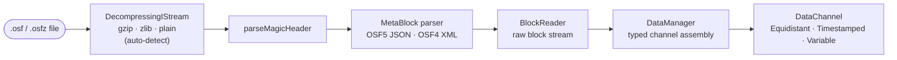
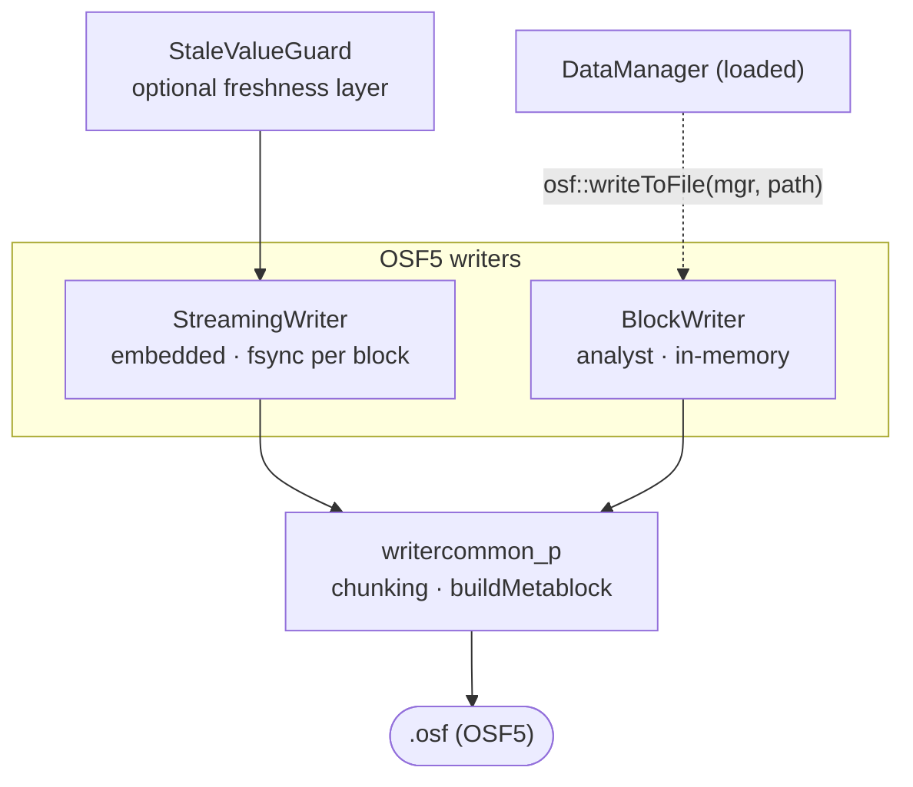
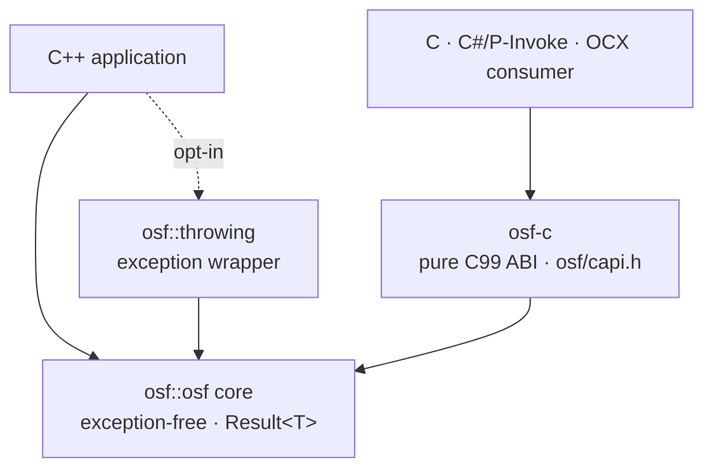

🇩🇪 [German version](../../de/implementations/cpp.md)

# C++ implementation

A **standalone C++17 implementation** of the Open Streaming Format — no FFI,
no Rust dependency, idiomatic modern C++. It reads `.osf` and `.osfz` files
and writes OSF5. The implementation was built as a parallel implementation
to the Rust core, not as a port.

## Capabilities

The implementation is **fully complete**. The read and write paths are covered by a
GoogleTest/ctest suite (0 warnings under MSVC `/W4 /permissive-`), and CI
builds and tests on **Linux, macOS and Windows**.

**Read path**

- Magic-header parser; OSF5 JSON and OSF4 XML metablock parsers
- Block-stream reader and the typed `DataManager` (unified in-memory reader
  with typed channels)
- Transparent **OSFZ** decompression (gzip/zlib) — `.osf` and `.osfz` are
  read through the same API

**Write path (OSF5)**

- `StreamingWriter` — embedded, sample by sample, `fsync` per block
  (power-loss safe), constant memory footprint
- `BlockWriter` — analyst-friendly, accumulates in memory and writes the
  whole file at the end; auto-bumps `sizeOfLengthValue` from 2 → 4 when
  needed
- `StaleValueGuard` — optional freshness layer that re-emits the last value
  of idle channels

**Convenience and bindings**

- A **throwing convenience layer** (`osf::throwing`) over the `Result<T>`
  core for callers that prefer exceptions
- The **C ABI library `osf-c`** (`osf/capi.h`) — a pure C99 layer for
  cross-language use (DLL/shared object)

## Architecture at a glance

Two API tiers sit on a shared, exception-free core (`osf::Result<T>`). The read
side assembles typed channels from the block stream; the write side offers two
writer classes for different deployment profiles; and a C ABI exposes the whole
thing to non-C++ consumers.

### Read path



`DataManager::loadFromFile()` drives this whole pipeline; OSFZ is detected and
inflated transparently, so `.osf` and `.osfz` use the same call.

### Write path (OSF5)



### Layering & the C ABI



### Which class for what

| You want to… | Use | Notes |
|---|---|---|
| Read a file, get typed channels | `osf::DataManager` | High-level entry point — `loadFromFile()`, `channel("name")`. Reads `.osf` and `.osfz`. |
| Iterate the raw block stream | `osf::BlockReader` | Lower-level; advanced / streaming consumers. |
| Hold a channel's samples | `osf::DataChannel` | Variant over Equidistant / Timestamped / Variable; typed flat accessors. |
| Record on an embedded device | `osf::StreamingWriter` | `fsync` per block, constant memory, power-loss safe. |
| Write a complete file in one go | `osf::BlockWriter` | Accumulates in memory, emits at `writeToFile()`; auto-bumps `sizeOfLengthValue`. |
| Keep idle channels "fresh" | `osf::StaleValueGuard` | Re-emits the last value of channels idle past a threshold. |
| Round-trip / OSF4 → OSF5 | free `osf::writeToFile(mgr, …)` | Loads a `DataManager` into a `BlockWriter` and writes OSF5. |
| Use exceptions, not `Result<T>` | `osf::throwing` | Opt-in header; not compiled into the core. |
| Call from C, C#, OCX, … | `osf-c` (`osf/capi.h`) | Pure C99 ABI; build with `-D OSF_BUILD_C_API=ON`. |

### Runnable examples

`implementations/cpp/examples/` ships four small programs over `<osf/osf.h>` —
**`inspect`** (header / metadata / channels, transparent OSFZ), **`dump`**
(sample values), **`write`** (synthesize and write OSF5) and **`copy`**
(round-trip). They build with `-D OSF_BUILD_EXAMPLES=ON` (on by default).

## Building — quick start

```bash
cmake -B build
cmake --build build
ctest --test-dir build
```

Platform-specific notes, CMake options and FAQ are in
[`BUILD.md`](https://github.com/optimeas/osf/blob/main/implementations/cpp/BUILD.md).

### CMake options

| Option | Default | Effect |
|---|---|---|
| `OSF_BUILD_TESTS` | `ON` | build the GoogleTest/ctest suite |
| `OSF_BUILD_EXAMPLES` | `ON` | build the runnable example programs under `examples/` |
| `OSF_BUILD_DOCS` | `OFF` | generate the Doxygen API reference (`osf-docs` target; needs Doxygen) |
| `OSF_BUILD_C_API` | `OFF` | also build the C ABI library `osf-c` (+ C test) |
| `OSF_USE_SYSTEM_ZLIB` | `OFF` | use system zlib instead of FetchContent |
| `OSF_WARNINGS_AS_ERRORS` | `OFF` | warnings as errors (`/WX` or `-Werror`); `ON` in CI |
| `BUILD_SHARED_LIBS` | `OFF` | build the core library as a shared library |

C++17 is the firmly-defined language baseline. Moving to C++20 or later is a deliberate library upgrade, not a build option. Third-party code (`tl::expected`, `nlohmann/json`,
`pugixml`) is vendored in the repository under `third_party/`; zlib comes via
FetchContent or the system.

### Linking

The library exports two CMake targets:

- `osf::osf` — the core library (static by default; file name `libosf.a` /
  `osf.lib`)
- `osf::headers` — an INTERFACE target with the public include paths

## API at a glance

The core is **exception-free**: operations that can fail return
`osf::Result<T>` (a `tl::expected<T, osf::Error>`).

### Reading

```cpp
#include <osf/manager.h>

auto result = osf::DataManager::loadFromFile("measurement.osf");  // also .osfz
if (!result) {
    // result.error().message  —  structured error, no exception
    return;
}
osf::DataManager const& mgr = *result;

// Address a channel by name
if (osf::DataChannel const* ch = mgr.channel("Sensor.Temperature")) {
    auto values = osf::asDoublesFlat(
        std::get<osf::TimestampedChannel>(*ch));   // typed access
}
```

Callers who prefer exceptions use the opt-in layer:

```cpp
#include <osf/throwing.h>

auto mgr = osf::throwing::load("measurement.osf");   // throws osf::Exception on error
```

### Writing (OSF5)

```cpp
#include <osf/blockwriter.h>

osf::BlockWriter writer;
auto idx = writer.addChannel(/* name, data type, channel type, … */);
// … add samples to idx …
writer.writeToFile("output.osf");
```

For embedded, power-loss-safe writing there is the `StreamingWriter`
(`fsync` per block) instead. A loaded `DataManager` can be written straight
back as OSF5 with the free function `osf::writeToFile(mgr, path)`
(round-trip / OSF4 → OSF5).

### C ABI (`osf-c`)

With `-D OSF_BUILD_C_API=ON` the shared library `osf-c` is built in addition,
with a pure C99 interface (`osf/capi.h`): opaque handles (`osf_manager`,
`osf_channel`), `osf_status` codes, a thread-local
`osf_last_error_message()` and copy-out readers for timestamps and values —
plus `osf_write_to_file` for the round-trip write path. No C++ exception
crosses the ABI boundary. Intended for binding from C, C#/P-Invoke,
ActiveX/OCX and future language bindings.

## Notes

- **Only OSF5 is written** — even when the source was an OSF4 file.
- **OSFZ on write is a post-close step**: the writers never compress inline;
  OSFZ (gzip) is produced *after* the `.osf` file is finalized — by a
  forthcoming post-close compressor (background thread) or a standalone
  compress CLI. OSFZ is **read** transparently.
- **Best-effort on read**: truncated files yield all data up to the last
  fully readable block, without crashing.
- The library is **Qt-neutral**; a Qt-aware add-on may follow later as a
  separate `integrations/` entry.

## Source code and further reading

- Source code on GitHub: [github.com/optimeas/osf](https://github.com/optimeas/osf),
  directory `implementations/cpp/`
- Build guide: [`BUILD.md`](https://github.com/optimeas/osf/blob/main/implementations/cpp/BUILD.md)
- API reference: generate with Doxygen via `-D OSF_BUILD_DOCS=ON` (the
  `osf-docs` target) — see `BUILD.md`
- Format specification: chapter [OSF format](../osf_general.md)
