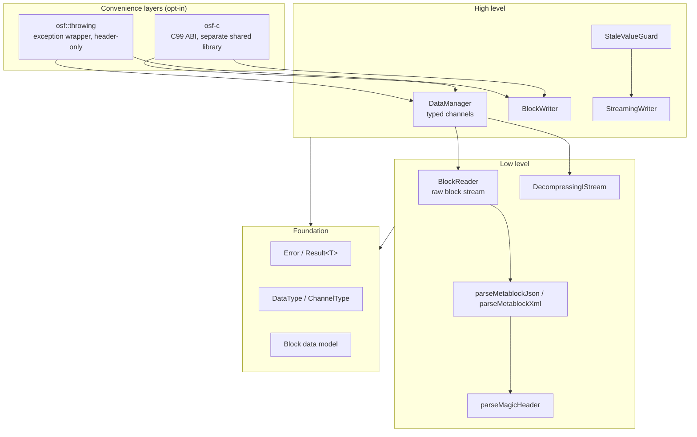
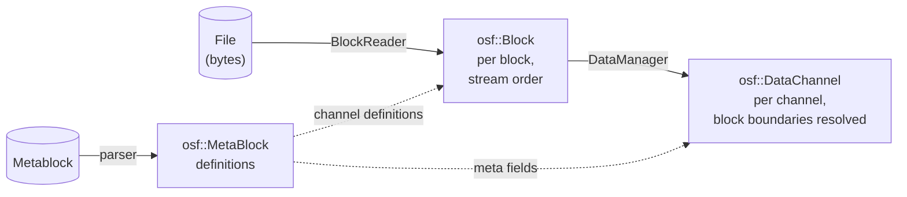

# Architecture of the C++ implementation

This page describes the internal structure of the C++ implementation:
the layering, the modules and how they interact, the data model and the
central design decisions. It is aimed at developers who integrate the
library **and** at those who want to contribute to it. The
[overview page](../cpp.md) gives a quick tour; the detail topics —
reading, writing, error handling, the C ABI and building — have their
own pages.

## Guiding principles

The implementation follows four principles:

1. **Standalone C++17.** Idiomatic modern C++ with no foreign-language
   bridges and no external runtime dependencies; its behaviour is
   defined solely by the OSF format specification.
2. **Exception-free core.** Every operation that can fail returns
   `osf::Result<T>` (a `tl::expected<T, osf::Error>`). Exceptions exist
   only in the opt-in `osf::throwing` layer.
3. **Best-effort on read.** Truncated files (power loss on the embedded
   writer) yield all fully readable blocks instead of an error; unknown
   future data types are skipped rather than aborting the load.
4. **Lean dependencies.** Three vendored header libraries
   (`tl::expected`, `nlohmann/json`, `pugixml`) plus zlib (FetchContent
   or system). No Boost, no Qt dependency.

## Layering



Most applications work exclusively at the high level (`DataManager` for
reading, one of the two writers for writing). The low level is public
and stable — anyone who wants to stream-read or build their own tools
uses `BlockReader` directly.

## Modules and responsibilities

| Header | Contents | Layer |
|---|---|---|
| `osf/error.h` | `Error` (code + message), `Result<T>` | Foundation |
| `osf/types.h` | `DataType`, `ChannelType`, `SpectrumType` + parsers | Foundation |
| `osf/header.h` | Magic header: `OsfVersion`, `MagicHeader`, `parseMagicHeader` | Low |
| `osf/metablock.h` | `MetaBlock`/`FileInfo`/`Channel`/`Info`; JSON and XML parsers; JSON serialization | Low |
| `osf/block.h` | Block data model: `Block`, `BlockKind`, payload variants, control-byte decoder | Foundation |
| `osf/reader.h` | `BlockReader` — iterator over the block stream | Low |
| `osf/stats.h` | `ReaderStats` / `ChannelStats` — read telemetry | Low |
| `osf/compression.h` | `DecompressingIStream`, `detectCompression` — transparent OSFZ | Low |
| `osf/datachannel.h` | `DataChannel` variant (Equidistant / Timestamped / Variable), `Segment`, flat accessors | High |
| `osf/manager.h` | `DataManager` — load + typed channel list | High |
| `osf/streamingwriter.h` | `StreamingWriter` + `ChannelDef` | High |
| `osf/blockwriter.h` | `BlockWriter` + free functions `writeToFile` / `writeTo` | High |
| `osf/stalevalueguard.h` | `StaleValueGuard` — freshness layer over `StreamingWriter` | High |
| `osf/binarysample.h` | `BinarySample` — non-owning byte view (span substitute) | Foundation |
| `osf/throwing.h` | `osf::Exception`, `throwing::unwrap/load/writeToFile` — **not** in the umbrella | Convenience |
| `osf/capi.h` | pure C99 ABI of the `osf-c` library — **not** in the umbrella | Convenience |
| `osf/osf.h` | umbrella header (everything except `throwing.h` and `capi.h`) | — |
| `osf/version.h` | generated; `osf::version()` and `OSF_VERSION_*` | Foundation |

Private implementation building blocks (under `src/`, not installable):
`blockencode_p.{h,cpp}` (OSF5 block encoder), `writercommon_p.{h,cpp}`
(chunking maths + metablock assembly), `durablefile_p.{h,cpp}`
(RAII file with `fsync`), `binaryio_p.h` (little-endian helpers).
See [Internals](internals.md) for details.

## Three data models — who sees what

The library deliberately has three representations of the same data,
depending on the level of abstraction:



1. **`osf::MetaBlock`** (`metablock.h`) — the *definitions*:
   file metadata (`FileInfo`), channel definitions (`osf::Channel`)
   and optional `Info` entries. OSF4 (XML) and OSF5 (JSON) differ only
   in serialization; both parsers fill the same model symmetrically.
2. **`osf::Block`** (`block.h`) — the *stream view*: a decoded block
   with channel index and `BlockKind` variant (`StartData`,
   `ContinuedData`, `AbsTimestampData`, `ContinuedRelStampData`,
   `Skipped`). Payloads are unpacked, typed vectors — no zero-copy
   (blocks are KB to a few MB; the simple lifetime semantics outweigh
   the allocation).
3. **`osf::DataChannel`** (`datachannel.h`) — the *channel view*:
   a `std::variant` over three storage layouts, because the storage
   genuinely differs:

   | Variant | Storage |
   |---|---|
   | `EquidistantChannel` | flat sample vector + `std::vector<Segment>` |
   | `TimestampedChannel` | parallel vectors `timestampsNs` + `values` |
   | `VariableChannel` | timestamps + string **or** binary samples |

**Naming note:** `osf::Channel` is the *channel definition* from the
metablock; `osf::DataChannel` is the *assembled samples*. Both share
the `osf` namespace, hence the different names.

## Naming and API conventions

- **Types** in PascalCase (`DataManager`, `BlockReader`).
- **Methods and free functions** in camelCase (`loadFromFile`,
  `channelName`, `asDoublesFlat`, `writeToFile`).
- **Public struct fields** in camelCase without a prefix (`blocksTotal`,
  `sizeOfLengthValue`, `startTimestampNs`, `compressionFormat`).
- **Private members** with an `m_` prefix + camelCase (`m_channelData`,
  `m_writer`).
- **Constants** in UPPER_SNAKE_CASE (`MAX_MAGIC_HEADER_LEN`,
  `GPS_WIRE_SIZE`).
- **Header file names** lowercase, no separators, extension `.h`
  (`blockwriter.h`, `streamingwriter.h`, `datachannel.h`). Internal
  headers in the `src/` directory carry the `_p.h` suffix
  (`blockencode_p.h`, `writercommon_p.h`).
- The **C ABI** (`osf_*` symbols in `osf/capi.h`) follows the
  C-conventional `snake_case` and is exempt from the C++ rules.
- Variant discriminators are named `kind` (`BlockKind`,
  `SkipReason::Kind`, `VariableValueRef::Kind`).
- Everything fallible returns `Result<T>` and is `[[nodiscard]]`.
- Construction via static factories (`DataManager::loadFromFile`) or
  builder-style configuration (writers: `set*` → `addChannel` → write
  phase).
- Fluent setters on `BlockReader` (`withCaptureSkippedPayload`,
  `withFileSize`) return `BlockReader&`.
- Timestamps are uniformly `std::int64_t` **nanoseconds since the Unix
  epoch (UTC)**; sample rates are `double` in Hz.

## Central design decisions

### `Result<T>` instead of exceptions in the core

The library also targets embedded and industrial codebases where
exceptions are disabled or unwanted. The core therefore never throws;
`tl::expected` (vendored, CC0) provides the monad. Callers who prefer
exceptions take [`osf::throwing`](error-handling.md) — a thin,
header-only layer that was deliberately **not** added to the umbrella
header, so that core users pull in no exception machinery.

### Best-effort and forward compatibility

Real OSF files are produced on devices that can lose power at any time,
and with spec revisions the reader does not yet know about. Three
behavioural rules follow:

- **Truncation is not an error.** If the file ends mid-block, the
  `BlockReader` yields all complete blocks, bumps
  `stats().blocksTruncated` to 1 and ends the iteration cleanly.
- **Unknown is skipped, not swallowed.** Channels with an unknown
  (future) data type parse as `DataType::Unsupported`; their blocks
  appear as `BlockKind::Skipped` (payload bytes are consumed so the
  stream stays aligned). The original spelling is preserved in
  `Channel::dataTypeRaw`.
- **Removed spec elements are hard errors.** Data types removed by the
  2026-05-04 spec revision (`pair`, `triple`, `candata`, `gpsdata`) are
  rejected with `Error::Code::RemovedInSpec` — their payload layout
  cannot be reproduced from a current build, and silent guessing would
  be data corruption.

### Two writers instead of one

`StreamingWriter` (embedded: `fsync` per block, constant memory,
power-loss safe) and `BlockWriter` (analyst: accumulates in memory,
emits at the end, can auto-bump `sizeOfLengthValue`) have incompatible
invariants — a single writer would have diluted both profiles. Shared
building blocks (chunking, metablock assembly) live in
`src/writercommon_p.*`. Details on the [Writing](writing.md) page.

### Transparent OSFZ on read only

OSFZ (= gzip- or zlib-compressed OSF) is detected and decompressed
transparently on **read** (`DecompressingIStream` ahead of the magic
header parse). On **write** the library deliberately never compresses
inline: compression is a downstream step after the file is finalized,
so that write and compression failure modes stay decoupled.

### Thread safety

| Class | Contract |
|---|---|
| `DataManager` (loaded) | immutable → readable from any number of threads |
| `BlockReader` | not thread-safe; one instance per thread |
| `StreamingWriter` / `BlockWriter` / `StaleValueGuard` | not thread-safe; serialize calls externally (e.g. `std::mutex`) |
| different writers to different files | fine in parallel |
| `osf-c` | `osf_last_error_message()` is thread-local; do not share handles across threads without serializing |

## Directory layout

```
implementations/cpp/
├── CMakeLists.txt           — project, options, targets
├── BUILD.md                 — build guide (EN)
├── cmake/                   — CompilerWarnings.cmake, version.h.in
├── include/osf/             — public headers (the API surface)
├── src/                     — implementation + private headers
├── tests/
│   ├── unit/                — GoogleTest units (synthetic data)
│   ├── integration/         — tests against examples/*.osf(z)
│   └── capi/                — pure C99 test for osf-c
├── examples/                — inspect, dump, write, copy
└── third_party/             — tl::expected, nlohmann/json, pugixml (vendored)
```

## Further reading

- [Reading — DataManager, DataChannel, BlockReader, OSFZ](reading.md)
- [Writing — StreamingWriter, BlockWriter, StaleValueGuard](writing.md)
- [Error handling — Result, error catalogue, throwing](error-handling.md)
- [C ABI — osf-c for C, C#, OCX](c-abi.md)
- [Building & integrating — CMake, options, CI](building.md)
- [Cookbook — recipes for typical tasks](cookbook.md)
- [Internals — encoder, chunking, builder state machine](internals.md)

> This document is licensed under [CC BY 4.0](https://creativecommons.org/licenses/by/4.0/). Attribution: optiMEAS GmbH and optiMEAS Switzerland GmbH.
