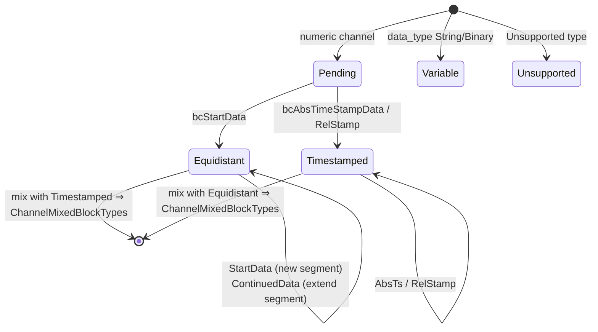

# Internals

This page describes the private building blocks in the library's `src/`
directory — relevant to anyone who contributes to it or wants to follow
its behaviour down to the byte level. The wire-format definitions
themselves are in the [OSF specification](../../osf_general.md).

## Overview of the private building blocks

| Building block | Files | Used by |
|---|---|---|
| Block encoder | `blockencode_p.{h,cpp}` | both writers |
| Writer commons (chunking, metablock assembly) | `writercommon_p.{h,cpp}` | both writers |
| Durable file I/O | `durablefile_p.{h,cpp}` | `StreamingWriter` only |
| Little-endian helpers | `binaryio_p.h` | encoder |
| Decompression streambuf | `compression.cpp` (class `DecompressingIStream::Streambuf`) | read path |
| Builder state machine | `manager.cpp` (struct `ChannelBuilder`) | `DataManager` |

## Block encoder (`osf::detail::encode*`)

The encoder writes complete block frames
`[u16 channel index][length field][payload]` into a byte vector
(little-endian throughout):

| Function | Block | Payload layout |
|---|---|---|
| `encodeStartData<T>` | `bcStartData` (6) | `[u8 ctrl][i64 start_ts][f64 rate][u32 N][N × T]` |
| `encodeContinuedData<T>` | `bcContinuedData` (5) | `[u8 ctrl][u32 N][N × T]` |
| `encodeAbsTimestampData<T>` | `bcAbsTimeStampData` (8) | `[u8 ctrl][u32 N][N × (i64 ts + T)]` |
| `encodeAbsTimestampDataGps` | ditto for GPS | value = 3 × f64 (lat, lon, alt) = 24 bytes |
| String/binary overloads | ditto, single sample | `[u8 ctrl][i64 ts][bytes]` — bit 7 = 0, **no** `0x00` terminator (OSF5) |

Conventions: bit 7 of the control byte is set only when the multi-sample
form (u32 N prefix) is used; for `count == 1` the prefix is omitted
(saves 4 bytes per single-sample block, spec rev 2026-05-24). The
writers call the encoder exclusively with capacity-conformant sample
counts pre-computed via `writercommon_p`.

## Chunking maths (`writercommon_p`)

A block's length field is `sizeOfLengthValue` (2 or 4) bytes wide; from
that follows the maximum payload per block:

```cpp
maxPayloadForSov(2) == 0xFFFF;                  // 65 535 bytes
maxPayloadForSov(4) == 0x7FFFFFFF - 1024;       // soft cap, avoids i32 overflow
```

From this, three helpers derive the maximum sample count per block type
(overhead: `bcStartData` 21 bytes = ctrl + ts + rate + N;
`bcContinuedData`/`bcAbsTimeStampData` 5 bytes = ctrl + N; for
timestamped, each sample counts 8 extra bytes of timestamp). For
variable single-sample blocks,
`variableSampleCapacity(sov) = max_payload - 9` (ctrl + ts). These
functions are the **only** place block sizes are computed — the
streaming and block writers chunk identically with them.

`buildMetablock(FileInfoDraft, ChannelDefs)` assembles the OSF5
metablock: indices sequential 0..N, `channeltype` normalized
(`equidistant` stays, everything else becomes `scalar` — the established
convention of the OSF reference files), and the automatic metadata
defaults are applied (`created_utc` = current UTC time as
`YYYY-MM-DDTHH:MM:SSZ`, `creator` fallback `osf-cpp/<version>`, `tag`
fallback `default`; `reason`/GPS triple stay omitted rather than `null`).

## `DurableFile` — the streaming writer's fsync semantics

A RAII wrapper around a native file handle with three operations:
`write` (complete or error), `force` (Windows: `FlushFileBuffers`,
POSIX: `fsync`) and `close`. The `StreamingWriter` calls `force` after
every block — that is why "the call returns successfully" is equivalent
to "the block is on the medium". Errors from `write`/`force` put the
writer into the `Broken` state (sticky error).

## Decompression streambuf (read path)

`DecompressingIStream` hides a custom `std::streambuf` behind a PIMPL so
the public header stays zlib-free:

- Classification on the first two bytes (`detectCompression`,
  non-consuming via read + seek-back — the source must be seekable).
- `underflow()` inflates on demand into a fixed buffer — constant memory
  regardless of file size.
- `inflateInit2(MAX_WBITS | 32)` enables zlib's own automatic gzip/zlib
  header detection.
- Truncated compressed streams yield EOF instead of an error
  (best-effort, consistent with the rest of the read path).
- For `CompressionFormat::None` the bytes are passed through 1:1 — so
  `DataManager` can put the facade in front unconditionally.

## Builder state machine (`DataManager`)

Per channel, `manager.cpp` holds a `ChannelBuilder` with five states:



Rules that enforce the transitions (all covered by tests):

- `bcContinuedData` in the `Pending` state ⇒ `ContinuedDataWithoutStart`.
- `bcContinuedRelStampData` without a prior absolute timestamp ⇒
  `RelStampWithoutAnchor`; otherwise the u32 deltas are summed up with
  the last absolute timestamp as the anchor.
- payload data type ≠ channel data type ⇒ `DataTypeMismatch`.
- `Unsupported` channels consume their blocks (already `Skipped` on the
  reader side) and are left out of the channel list at `finalize`.

`finalizeBuilder` translates the final state into the matching
`DataChannel` variant; `Pending` without any block is materialized as an
empty channel of the declared type.

## Reader details

- Byte decoding via small `readLeU16`/`readLeU32`/`readLeU64` helpers
  (plus signed/float overloads) instead of `reinterpret_cast` — free of
  alignment and endianness assumptions.
- `PayloadCursor` walks the in-memory block payload and returns
  `std::optional<T>`; an overflow thus becomes a clean `InvalidBlock`
  instead of UB.
- Multi-sample string/binary blocks (bit 7 set) are split by equal
  length; on a non-divisible length the reader falls back to single
  sample.
- The null terminator is handled version-deterministically (field
  `m_osfVersion` in the reader): OSF4 strips the last byte of every
  string/binary payload, OSF5 never (spec rev 2026-05-24).
- The optional OSF4 `0xFFFF` info block and the 40-byte trailer
  (`OSF_STREAM_END …`) are consumed and never delivered as a `Block`.

## Test layout and verification

| Level | Location | Character |
|---|---|---|
| Unit | `tests/unit/test_*.cpp` | synthetic bytes/structures, one file per module |
| Integration | `tests/integration/*_examples.cpp` | real files from `examples/` (field data + 17 generated reference files) |
| Round-trip | `tests/integration/roundtriphelper.h` | load → write → reload → **bit-exact** sample comparison |
| C ABI | `tests/capi/test_capi.c` | standalone C99 program, proves C linkage |

Before every push: a full ctest run green locally (currently 321 tests
with `OSF_BUILD_C_API=ON`), 0 warnings; CI additionally verifies
GCC/AppleClang/MSVC with `-Werror`/`/WX`.

## Adding a new data type (checklist)

If a future spec revision adds a data type:

1. `types.h/cpp` — enumerator + wire spelling in `parseDataType`.
2. `block.h` — extend the payload variants (`NumericPayload`,
   `TimestampedPayload`, and `RelTimestampedPayload` if applicable).
3. `reader.cpp` — decoder branch (sample size, payload parser).
4. `datachannel.h/cpp` — `NumericValues`, flat-accessor macro,
   `numericValuesEmptyFor`.
5. `manager.cpp` — extend the `*PayloadDataType` visitor.
6. `blockencode_p` + writers — encoder instantiation,
   `IsTimestampedNumeric` specialization in both writer headers.
7. `capi` — `osf_data_type` + conversion reader if applicable.
8. tests at every level; add reference files in the generator.

That the list is long is by design: every layer is explicitly typed,
nothing is routed through `void*` or runtime casts.
