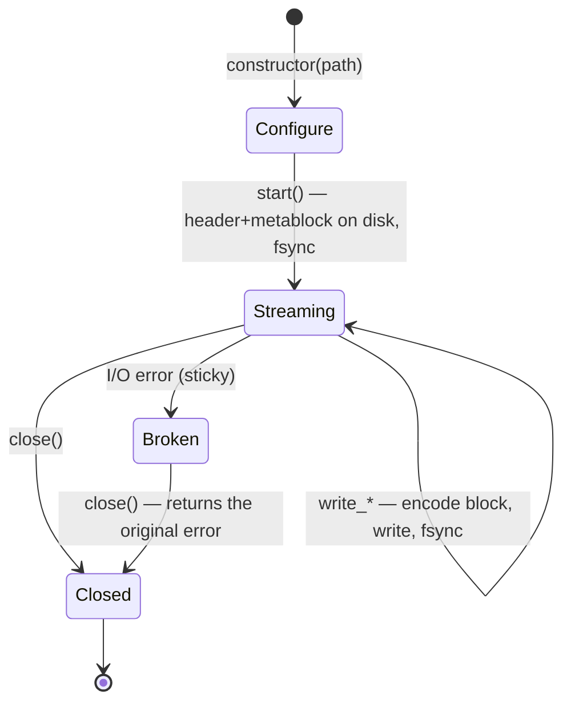

# Writing

The library writes **OSF5 only** — even when the source was an OSF4
file. Two writer classes cover two very different deployment profiles:

| | `StreamingWriter` | `BlockWriter` |
|---|---|---|
| Use | embedded recording | analysis, conversion, export |
| Memory | constant (scratch buffer) | accumulates all samples in RAM |
| Durability | `fsync` per block — power-loss safe | no fsync; file is produced at the end |
| Sink | file path | file path **or** `std::ostream` (memory, socket) |
| `sizeOfLengthValue` | fixed from `start()` (metablock is on disk) | auto-bump 2 → 4 when needed |
| Lifecycle | configure → `start()` → write → `close()` | accumulate → `writeToFile()` / `writeTo()` (any number of times) |
| Multiple emission | no (one file per instance) | yes (`writeTo*` is `const`) |

Both share the channel description `osf::ChannelDef` and the same write
families (equidistant, timestamped numeric, GPS, string/binary).

## Declaring channels — `ChannelDef`

```cpp
osf::ChannelDef def;
def.name             = "motor.rpm";              // required
def.dataType         = osf::DataType::Double;    // required
def.channelType      = osf::ChannelType::Scalar; // required (Scalar = convention)
def.sizeOfLengthValue = 2;                       // 2 (default) or 4
def.physicalUnit     = "1/min";                  // optional
def.displayName      = "Engine speed";           // optional
// also: physicalDimension, mimeType, reference, comment, timeIncrementNs
```

`addChannel(def)` returns the channel index (sequential from 0) that all
write calls use. Rejected (`InvalidArgument`): `sizeOfLengthValue` ≠ 2/4,
`Unsupported` types, more than 65535 channels — and on the
`StreamingWriter`, additionally any call after `start()`.

### Choosing `sizeOfLengthValue` correctly

Each block's length field is 2 or 4 bytes wide and bounds the block size
(~64 KB or ~2 GB). Practical rules:

- **String/binary channels with large samples** (images, audio, blobs):
  on the `StreamingWriter` you must declare `4` — it cannot change the
  value after `start()` and rejects oversized samples with
  `InvalidBlock`. The `BlockWriter` bumps it itself (2 → 4 on emit), so
  `2` as a starting value is always fine there.
- **High-rate numeric channels** on the `StreamingWriter`: `4` saves
  chunking — a 100k-sample `double` append into a `sov=2` channel
  otherwise splits into ~13 blocks = ~13 fsyncs.
- Otherwise: stay on the default `2` (more compact blocks).

## `StreamingWriter` — embedded, power-loss safe

### Lifecycle



```cpp
#include <osf/streamingwriter.h>

osf::StreamingWriter w("recording.osf");
w.setCreator("logger-fw/3.2");                 // metadata before start()
w.setTag("test-bench-7");

auto rpm = w.addChannel(rpmDef);               // Result<uint16_t>
auto gps = w.addChannel(gpsDef);
if (!rpm || !gps) { /* … */ }

if (auto r = w.start(); !r) { /* file open, metablock written */ }

// recording loop
while (running) {
    auto r = w.writeTimestampedSample<double>(*rpm, nowNs(), readRpm());
    if (!r) { /* I/O error => writer is Broken; abort */ break; }
}

if (auto r = w.close(); !r) { /* … */ }
```

Guarantees and behaviour:

- **Every successfully returned `write_*` is on disk**
  (`FlushFileBuffers` on Windows, `fsync` on POSIX). After power loss
  the file is readable up to the last acknowledged block — the reader is
  designed for exactly this scenario (best-effort on truncation).
- **Sticky error:** after an I/O error the writer enters the `Broken`
  state; every further call (including `close()`) returns the original
  error. That way the cause is not lost in fire-and-forget loops.
- **Metadata setters take effect only before `start()`** — the
  metablock is written by `start()` and never touched again.
- **No OSFZ:** the streaming writer writes raw `.osf` files. Compression
  is a downstream step — write and compression failure modes stay
  decoupled.
- Move-constructible/assignable, not copyable. Not thread-safe —
  serialize access externally.
- The scratch buffer grows to the size of the largest block ever written
  and is released only in the destructor.

### Write families

```cpp
// Equidistant (float/double only, per spec) — open a segment + extend it:
w.startEquidistantSegment(ch, t0Ns, 1000.0 /*Hz*/, data.data(), data.size());
w.appendEquidistantSamples(ch, more.data(), more.size());   // needs an open segment

// Timestamped numeric (11 types, template):
w.writeTimestampedSample<std::int32_t>(ch, tsNs, value);
w.writeTimestampedSamples<double>(ch, tsArray, values, n);  // parallel arrays

// GPS (own symbols, no template):
w.writeTimestampedGpsSample(ch, tsNs, osf::GpsLocation{lat, lon, alt});

// String/binary (one sample per block per spec; OSF5: no 0x00 terminator):
w.writeTimestampedString(ch, tsNs, "Event: door open");
w.writeTimestampedBinary(ch, tsNs, osf::BinarySample::fromVector(jpegBytes));
```

Each multi-sample call is automatically chunked to the channel's block
capacity (one fsync per block). A new `startEquidistantSegment`
deliberately opens a **new** segment — gaps between segments are the
spec-compliant way to represent recording pauses.

## `BlockWriter` — accumulate and emit

```cpp
#include <osf/blockwriter.h>

osf::BlockWriter w;
w.setCreator("analysis-tool/1.0");

auto ch = w.addChannel(def);
w.addEquidistantSegment(*ch, t0Ns, 100.0, samples.data(), samples.size());
w.addTimestampedSample<double>(*ev, tsNs, 42.0);
w.addStringSample(*log, tsNs, "Calibration ok");

if (auto r = w.writeToFile("result.osf"); !r) { /* … */ }

std::ostringstream mem;                 // or into any ostream
if (auto r = w.writeTo(mem); !r) { /* … */ }
```

- The `add*` family mirrors the `write*` family of the streaming writer
  (same types, same validation) but only accumulates in memory; chunking
  into spec-compliant blocks happens at emit.
- `writeToFile` / `writeTo` are **`const`** — the same instance may be
  emitted multiple times (e.g. file + network).
- **Auto-bump:** variable channels whose largest sample does not fit the
  declared u16 length field receive `sizeOfLengthValue = 4` for the
  emission.
- No fsync — durability is the caller's responsibility.
- `channelIndex("name")` and `channelCount()` help when the indices are
  not carried along.

## Automatic metadata defaults

Both writers apply the same defaults when assembling the metablock:

| Field | Behaviour when unset |
|---|---|
| `createdUtc` | **always** stamped automatically (current UTC time, `YYYY-MM-DDTHH:MM:SSZ`; the on-disk JSON key is `created_utc`) |
| `creator` | `osf-cpp/<library version>` |
| `tag` | `default` |
| `reason`, `createdAt*`, `namespaceSep`, `comment` | omitted (not written as `null` when unset) |

## `StaleValueGuard` — keeping idle channels fresh

Sporadic (event) channels only get a sample on value change. On a
timeline, a channel last written hours ago is ambiguous: is the value
still valid, or is the recording dead? The optiMEAS convention bounds
this "staleness" by repeating the last value at least every 100 s. The
guard automates exactly that, as a write-through wrapper over a started
`StreamingWriter`:

```cpp
#include <osf/stalevalueguard.h>

osf::StreamingWriter w(path);
/* … configure, start() … */
osf::StaleValueGuard guard(w);                  // default: 100 s; custom value possible

// Route timestamped writes through the guard (caches the last value):
guard.writeTimestampedSample<double>(tempCh, tsNs, 21.5);

// Periodically (e.g. in the recording tick):
auto reemitted = guard.poll(nowNs);             // Result<std::size_t>
```

Properties:

- **Pull-based:** no internal thread, no own clock — the caller supplies
  `now_ns` to `poll()`. Deterministic and embedded-suitable.
- At most **one** repeat per channel per `poll()` (no backfill of the
  gap).
- Numeric + GPS channels only; string/binary deliberately not (repeating
  large blobs would be counterproductive).
- Channels are tracked automatically on the first write-through;
  `isTracked` / `forget` / `clear` steer the tracking.
- Real writes reset the inactivity clock — actively written channels
  never get a synthetic repeat.

## Round-trip and conversion

Write a loaded `DataManager` back out (also as OSF4 → OSF5 conversion):

```cpp
#include <osf/manager.h>
#include <osf/blockwriter.h>

auto mgr = osf::DataManager::loadFromFile("old.osf");     // also OSF4 / OSFZ
if (!mgr) { /* … */ }

if (auto r = osf::writeToFile(*mgr, "new.osf"); !r) { /* … */ }   // always OSF5
```

Internally `BlockWriter::fromManager(mgr)` builds a writer from the typed
channels; to filter or rename before writing, use `fromManager` directly
and work on the writer.

Preserved: channel names, data types, sample values (bit-exact), segment
boundaries, file metadata (except `created_utc`, which is re-stamped on
write). **Not** preserved is the channel index — the writer assigns
0..N sequentially anew.

## What the writers deliberately do not do

- **No OSF4 output** — OSF5 is the only write format.
- **No OSFZ output** — compression is downstream; a post-close
  compressor and an `osf-compress` CLI are designed as follow-up work.
- **No `bcContinuedRelStampData`** — the relative time format is an OSF4
  read-side legacy; writers emit absolute timestamps.
- **No timestamp validation** — monotonicity is not required by the spec
  and is not enforced.
