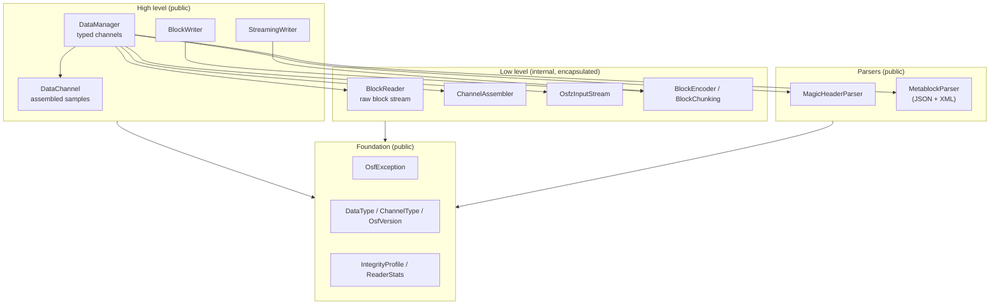
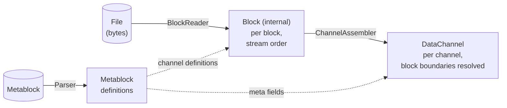

# Architecture of the Java Implementation

This page describes the internal structure of the Java implementation:
the layer model, the modules and how they interact, the data model, and
the central design decisions. It is aimed at developers who embed the
library **and** at those who want to contribute to it. The
[overview page](../java.md) gives a quick tour; the detail topics
reading, writing, error handling, tools and build have their own pages.

## Guiding principles

The implementation follows four principles:

1. **Modern, self-contained Java 21.** Idiomatic Java on the current LTS
   level — records, sealed types, `switch` patterns — with no
   cross-language bridges. Behaviour is defined solely by the OSF format
   specification, not by porting a reference.
2. **Strict encapsulation via JPMS.** The Java Platform Module System
   descriptor exports only `com.optimeas.osf`; the internal package
   `com.optimeas.osf.internal` stays sealed even against reflection. The
   public surface is therefore small and stable.
3. **Best-effort reading.** Truncated files (power loss on an embedded
   writer) yield every fully readable block instead of an error; unknown
   future data types are skipped rather than aborting the load.
4. **Lean, mainstream dependencies.** Jackson for the OSF5 JSON, the
   StAX API bundled in the JDK for the OSF4 XML, `java.util.zip` (OSFZ
   decompression + CRC32C), and SLF4J as the logging facade. No heavy
   frameworks.

## Layer model



Most applications work exclusively on the high level (`DataManager` for
reading, one of the two writers for writing). The low level — block
reader, channel assembler, OSFZ stream, encoder — lives in the
encapsulated package `com.optimeas.osf.internal` and is invisible from
the outside; the whole read pipeline is orchestrated by `DataManager`.

## Modules and responsibilities

The Maven reactor `com.optimeas.osf:osf-parent` groups three modules:

| Module | Artifact | Role |
|---|---|---|
| Core library | `com.optimeas.osf:osf-java` | Reading (OSF4 + OSF5 + OSFZ), both OSF5 writers, the `crc` integrity profile |
| Command line | `osf-cli` | Inspecting and converting OSF files; executable jar |
| Viewer | `osf-viewer` | JavaFX application for multi-channel signal display |

This page describes the core module. The public surface of the core
(package `com.optimeas.osf`):

| Type | Content | Layer |
|---|---|---|
| `DataManager` | load + typed channel list + telemetry | High |
| `DataChannel` | one channel's assembled samples; `Kind`, `Segment` | High |
| `StreamingWriter` | power-loss-safe OSF5 writer (`fsync` per block) | High |
| `BlockWriter` | in-memory accumulating OSF5 writer; `fromManager` | High |
| `MagicHeader` / `MagicHeaderParser` | magic-header line + integrity tokens | Parser |
| `Metablock` / `MetablockParser` / `ChannelDef` | definitions; JSON **and** XML parser | Parser |
| `DataType` / `ChannelType` | wire enums + `fromWireName` | Foundation |
| `OsfVersion` | on-disk version (OSF4 / OSF5) | Foundation |
| `GpsLocation` | GPS sample (record: `latitude`/`longitude`/`altitude`) | Foundation |
| `IntegrityProfile` | integrity level (`NONE` / `CRC32C` / `ED25519`) | Foundation |
| `ReaderStats` | read telemetry (blocks, truncation, compression) | Foundation |
| `OsfException` | exception hierarchy (see below) | Foundation |

Internal building blocks (package `com.optimeas.osf.internal`, **not**
exported): `BlockReader` + `Block` (raw block stream), `ChannelAssembler`
(block → channel), `OsfzInputStream` (transparent OSFZ decompression),
`BlockEncoder` + `BlockChunking` (OSF5 block encoder + chunking
arithmetic), `Integrity` (CRC32C framing), `MetablockBuilder`,
`JsonMetablockParser` / `XmlMetablockParser`, and `LittleEndian`
(byte-order helper). Details on the [Internals](internals.md) page.

## JPMS encapsulation

The module descriptor `module-info.java` draws a hard boundary:

```
module com.optimeas.osf {
    requires com.fasterxml.jackson.databind;
    requires org.slf4j;
    requires java.xml;          // StAX for the OSF4 XML metablock

    exports com.optimeas.osf;
    // com.optimeas.osf.internal is intentionally NOT exported.
}
```

Only `com.optimeas.osf` is exported. The internal package is encapsulated
on two levels: the compiler denies access to non-exported types, and —
because there is no `opens` directive — it also stays sealed against
reflection at runtime. Application code can therefore neither import nor
reflectively address the internal classes.

This has a visible consequence in the data model: `DataChannel` does
carry a nominally `public` constructor for the `ChannelAssembler`, but
its parameter type (`Block.Values`) lives in the internal package. From
outside the module the constructor thus cannot be called — `DataChannel`
instances are only ever produced through the `DataManager`.

## Three data models — who sees what

The library deliberately has three representations of the same data,
depending on the level of abstraction:



1. **`Metablock`** (`MetablockParser`) — the *definitions*: file-level
   metadata (`Map<String,String>`) and channel definitions
   (`ChannelDef`). OSF4 (XML, via StAX) and OSF5 (JSON, via Jackson)
   differ only in serialization; both parsers populate the same model
   symmetrically.
2. **`Block`** (internal) — the *stream view*: a decoded block with a
   channel index and block kind (`bcStartData`, `bcContinuedData`,
   `bcAbsTimeStampData`, `bcContinuedRelStampData`). Payloads are held as
   unpacked, typed `Block.Values` records so no datatype information is
   lost. This model is encapsulated and never appears in the public API.
3. **`DataChannel`** — the *channel view*: one flat run of samples per
   channel with parallel absolute timestamps, the block boundaries
   resolved. A single class type whose storage layout is distinguished by
   a `Kind` discriminator:

   | `Kind` | Storage |
   |---|---|
   | `EQUIDISTANT` | flat sample run + `List<Segment>`; timestamps reconstructed |
   | `TIMESTAMPED` | numeric/GPS with explicit parallel timestamps |
   | `VARIABLE` | string **or** binary samples, always timestamped |

**Naming note:** `ChannelDef` is the *channel definition* from the
metablock; `DataChannel` is the *assembled samples*. The typed accessors
`asDoubles()`, `asLongs()`, `asBooleans()`, `asStrings()`, `asBinaries()`
and `asGps()` project the stored run; if the `dataType()` does not match
the requested view, the accessor throws `OsfException.UnsupportedType`.

## Naming and API conventions

- **Types** in PascalCase (`DataManager`, `BlockWriter`).
- **Methods and accessors** in camelCase **without** a `get` prefix
  (`loadFromFile`, `channelByName`, `timestampsNs`, `asDoubles`); records
  carry component-named accessors (`name()`, `index()`).
- **Enum constants** in UPPER_SNAKE_CASE (`EQUIDISTANT`, `OSF4`,
  `CRC32C`, `GPS_LOCATION`); every wire enum carries the exact wire
  spelling via `wireName()` and is resolved through the infallible
  factory `fromWireName(String)`.
- **Value carriers** are records where immutable (`GpsLocation`,
  `DataChannel.Segment`).
- Fallible operations throw from an exception hierarchy under
  `OsfException` (`RuntimeException`); the read/write API has no checked
  exceptions.
- Lookups return `Optional<DataChannel>` (`channelByName`,
  `channelByIndex`) rather than `null`.
- Construction goes through static factories (`DataManager.loadFromFile`,
  `DataManager.load`, `BlockWriter.fromManager`) or builder-style writer
  configuration (`add…Channel` → append samples → write phase).
- Timestamps are `long` **nanoseconds since the Unix epoch (UTC)**
  throughout; sample rates are `double` in Hz.

## Central design decisions

### Encapsulation over a wide API

The public surface is deliberately confined to one package. The whole
read path — block decoding, channel assembly, OSFZ decompression, CRC
checking — sits behind `DataManager` and is unreachable through JPMS.
This keeps the promised API small, so internal refactors break no
consumer code.

### Best-effort and forward compatibility

Real OSF files are produced on devices that can lose power at any moment,
and with spec revisions the reader does not yet know. Three behavioural
rules follow:

- **Truncation is not an error.** If the file ends mid-block, the reader
  yields all complete blocks and sets `ReaderStats.truncationSeen()` to
  `true` rather than throwing.
- **The unknown is tolerated.** An unknown (future) data type parses as
  `DataType.UNSUPPORTED`, an unknown channel type as
  `ChannelType.UNSUPPORTED`; the file still loads and the original
  spelling is preserved in the channel's `attributes` entry.
- **Removed spec elements are hard errors.** Data types removed from the
  specification (`pair`, `triple`, `candata`, `gpsdata`) are rejected
  with `OsfException.UnsupportedType` — their payload layout cannot be
  reproduced, and silent guessing would be data corruption.

### Two writers, not one

`StreamingWriter` (embedded: `fsync` per block via `FileChannel.force`,
constant memory, crash-safe) and `BlockWriter` (analyst: accumulates in
memory, emits at the end, can auto-bump `sizeoflengthvalue` from 2 to 4)
have irreconcilable invariants — a single writer would have watered down
both profiles. Yet both share the same chunking arithmetic
(`BlockChunking`) and, for identical channels, samples,
`sizeoflengthvalue` and `created_utc`, produce **byte-identical OSF5**.
Details on the [Writing](writing.md) page.

### Transparent OSFZ on read only

OSFZ (= gzip- or zlib-compressed OSF) is detected and decompressed
transparently on **read**: `DataManager.load` wraps the source in an
`OsfzInputStream` before the magic-header parse and fills
`ReaderStats.compressed()` / `compressionFormat()`. On **write** the
library deliberately never compresses inline; compression is a
downstream step.

### The `crc` integrity profile

If the magic header carries a `crc32c` token, `DataManager.load` verifies
the metablock's CRC32C fail-closed against the header value and rejects a
mismatch with `OsfException.MetablockCrcMismatch`; block frames are
validated by CRC32C as well. Signed files
(`IntegrityProfile.ED25519`) are read transparently — signature blocks
are skipped and counted — but the signatures are not verified.

### Thread safety

| Class | Contract |
|---|---|
| `DataManager` (loaded) | immutable → readable from any number of threads |
| `DataChannel` | immutable; do not mutate the backing arrays |
| `StreamingWriter` / `BlockWriter` | not thread-safe; serialize calls externally |
| different writers on different files | fine in parallel |

## Directory layout

```
implementations/java/
├── pom.xml                    — reactor (osf-parent), three modules
├── osf-java/                  — core library
│   ├── pom.xml
│   └── src/main/java/
│       ├── module-info.java   — JPMS descriptor
│       └── com/optimeas/osf/
│           ├── *.java         — public API surface
│           └── internal/      — encapsulated building blocks
├── osf-cli/                   — command-line tool (picocli)
└── osf-viewer/                — JavaFX viewer
```

## Further reading

- [Reading — DataManager, DataChannel, OSFZ](reading.md)
- [Writing — StreamingWriter, BlockWriter](writing.md)
- [Error handling — the OsfException hierarchy](error-handling.md)
- [Tools — osf-cli and osf-viewer](tools.md)
- [Building & embedding — Maven, JPMS, CI](building.md)
- [Cookbook — recipes for common tasks](cookbook.md)
- [Internals — encoder, chunking, assembler](internals.md)
- [Format specification](../../osf_general.md)

> This document is licensed under [CC BY 4.0](https://creativecommons.org/licenses/by/4.0/deed.en). Attribution: optiMEAS GmbH and optiMEAS Switzerland GmbH.
