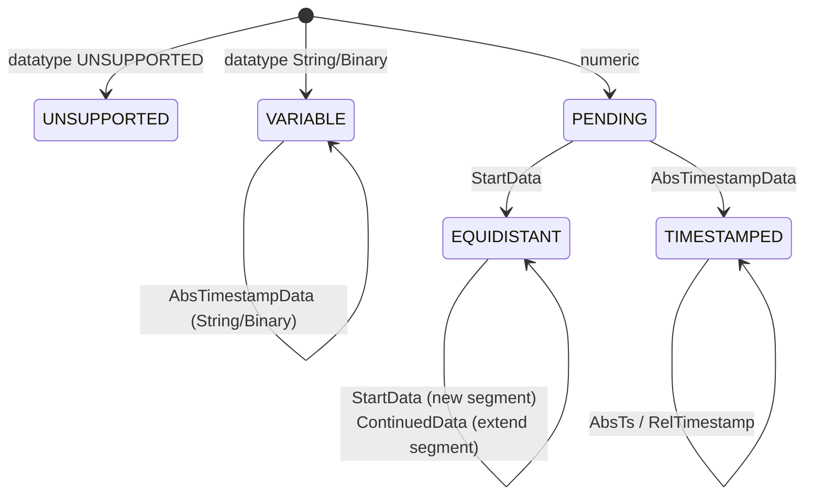

# Internals

This page describes the private building blocks in the encapsulated
package `com.optimeas.osf.internal` — relevant for anyone contributing to
the library or reconstructing its behaviour down to the byte level. The
wire-format definitions themselves live in the
[format specification](../../osf_general.md); the public surface is
covered by the [Architecture](./architecture.md) page.

## The "not exported" boundary

The module descriptor `module-info.java` exports **only**
`com.optimeas.osf`. The package `com.optimeas.osf.internal` is
deliberately **not** exported and — because there is no `opens` — also
sealed against reflection at runtime. Application code can neither import
nor reflectively address these classes; they are pure implementation
surface and may be reshaped without breaking the API.

| Building block | Class(es) | Used by |
|---|---|---|
| Block model | `Block` (sealed) + `Block.Values` | reader, assembler |
| Block reader | `BlockReader` | `DataManager` |
| Block encoder | `BlockEncoder` | both writers |
| Chunking arithmetic | `BlockChunking` | both writers |
| Metablock reading | `JsonMetablockParser`, `XmlMetablockParser` | `DataManager` |
| Metablock writing | `MetablockBuilder` | both writers |
| Integrity helper (write) | `Integrity` | both writers |
| Channel assembler | `ChannelAssembler` | `DataManager` |
| OSFZ decompression | `OsfzInputStream` | `DataManager` |
| Byte-order helper | `LittleEndian` | reader + encoder |

All binary I/O goes through `java.nio.ByteBuffer` / `FileChannel` with
`ByteOrder.LITTLE_ENDIAN` — there are no `reinterpret`-style casts and no
endianness assumptions.

## Block encoder (`BlockEncoder`)

The encoder writes one complete OSF5 block into a `byte[]`. The frame is
little-endian throughout:

```
[u16 channelIndex][length field (sizeOfLengthValue bytes)][u8 control][body…]
```

The length field counts the bytes of `control + body`. The control byte
carries the block kind in bits 0–6 and the multi-sample flag in bit 7
(`0x80`) — set exactly when `count != 1`; the body then begins with a
`u32` sample count N, otherwise exactly one sample follows with no N
prefix.

| Method | Block kind (control) | Body |
|---|---|---|
| `timestampedBlock` | `bcAbsTimeStampData` (`0x08`) | per sample `[i64 ts][value]` |
| `timestampedGpsBlock` | `bcAbsTimeStampData` | per sample `[i64 ts][3 × f64]` (24 B) |
| `startDataBlock` | `bcStartData` (`0x06`) | `[i64 startTs][f64 rate][N?][values]` |
| `continuedDataBlock` | `bcContinuedData` (`0x05`) | `[N?][values]` |
| `variableStringBlock` / `variableBinaryBlock` | `bcAbsTimeStampData` | single sample `[i64 ts][bytes]` |

`startDataBlock` and `continuedDataBlock` accept `float` / `double` only
(`requireFloatOrDouble`, otherwise `OsfException.MalformedFile`). String
and binary are written **one** sample per block in the compact form
(bit 7 clear, no N prefix), UTF-8 encoded and with **no** trailing
`0x00` (OSF5); an embedded `0x00` is legitimate content and is preserved.
`frame(…)` checks `sizeOfLengthValue ∈ {2, 4}` and that the payload fits
the length field. The internal `Body` class is a small little-endian byte
builder (`u8/u16/u32/i16/i32/i64/f32/f64`); `f32`/`f64` go through
`Float.floatToRawIntBits` / `Double.doubleToRawLongBits`.

`applyFrameCrc(frame, sizeOfLengthValue)` stamps a finished frame with the
integrity CRC: it bumps the on-disk length field by 4 (so it counts the
CRC) and appends the CRC32C over the **whole** patched frame as four
little-endian bytes — exactly what the reader recomputes.

## Chunking arithmetic (`BlockChunking`)

This class is the **single** place block sizes are computed; because both
writers call it, they chunk byte-for-byte identically (the basis of the
byte-identity guarantee). The length-field width fixes the maximum
payload:

```java
MAX_PAYLOAD_U16 = 0xFFFF;                 // 2-byte length field
MAX_PAYLOAD_U32 = Integer.MAX_VALUE - 1024;  // soft cap, avoids i32 overflow
```

When the integrity profile is active, the frame CRC
(`FRAME_CRC_RESERVE = 4` bytes) is counted in the length field per block
and therefore eats into the payload budget. On that budget three helpers
derive the maximum sample count per block kind (overhead:
`bcAbsTimeStampData` 5 B = ctrl + N plus 8 B timestamp per sample;
`bcStartData` 21 B = ctrl + startTs + rate + N; `bcContinuedData` 5 B =
ctrl + N):

```java
maxSamplesPerTimestamped(valueSize, sov, frameCrc);  // perSample = 8 + valueSize
maxSamplesPerStart(valueSize, sov, frameCrc);
maxSamplesPerContinued(valueSize, sov, frameCrc);
maxSamplesPerTimestampedGps(sov, frameCrc);          // GPS_VALUE_SIZE = 24
```

Each helper returns at least 1 (`Math.max(1, …)`), so a single oversized
sample can never spin into an endless loop.

## Integrity helper (`Integrity`)

The write side of the OSF5 integrity profile *level crc*. `magicLine`
builds the magic-header line `OSF5 <len>\n` and, when the profile is
active, appends a `crc32c:<HEX8>` token — the CRC32C of the metablock
bytes as eight upper-case hex digits (`hex8`). This protects the
metablock in the header; the data-block frame CRCs come from
`BlockEncoder`. All CRC computation uses `java.util.zip.CRC32C`.

## OSFZ decompression stream (`OsfzInputStream`)

`wrap(in, onFormat)` detects gzip/zlib transparently at the stream start.
Through a `PushbackInputStream(in, 2)` two bytes are peeked and
classified:

- **gzip** — `0x1F 0x8B` → `GZIPInputStream`, `onFormat("gzip")`.
- **zlib** — `0x78` followed by `0x01 / 0x5E / 0x9C / 0xDA` →
  `InflaterInputStream`, `onFormat("zlib")`.
- **plain** — anything else (real OSF starts with `'O' = 0x4F`); the
  peeked bytes are pushed back and the stream is passed through unchanged;
  `onFormat` is **not** called.

Streams shorter than two bytes are treated as plain — the downstream
magic-header parser then reports the appropriate error. The callback
typically feeds `ReaderStats.setCompression`.

## Metablock parsers (`JsonMetablockParser` / `XmlMetablockParser`)

Both parsers fill the same `Metablock` model (file metadata as a
`Map<String,String>` plus a `ChannelDef` list) symmetrically:

- **OSF5 / JSON** — `JsonMetablockParser` (Jackson) reads the `osf`
  envelope with `format`, `version`, `file{}` and `channels[]`. Required
  per-channel fields: `index` (0..65535), `name`, `channeltype`,
  `datatype`, `sizeoflengthvalue` (must be 2 or 4). `timeincrement`
  (absent/0 ⇒ non-equidistant) and `physicalunit` are optional; the
  remaining scalar string fields go into the `attributes` map.
- **OSF4 / XML** — `XmlMetablockParser` (StAX) reads the `<optimeas>`
  root element with file attributes and `<channel>` children. The
  `XMLInputFactory` is configured **XXE-safe**
  (`IS_SUPPORTING_EXTERNAL_ENTITIES = false`, `SUPPORT_DTD = false`,
  `IS_REPLACING_ENTITY_REFERENCES = false`); the version is set to 4.

Unknown (future) data types become `DataType.UNSUPPORTED`, unknown
channel types `ChannelType.UNSUPPORTED`; the original wire spelling is
preserved in the `attributes` entry. Data types removed from the
specification throw `OsfException.UnsupportedType`. Jackson and StAX types
**never** appear in the public model records. The write side is
`MetablockBuilder` (which builds the same JSON wire contract: `osf.file`
verbatim, `osf.channels[]` with `index` re-derived from list position;
`timeincrement` only when an increment is present).

## Channel assembler (`ChannelAssembler`)

`assemble(channelDefs, blocks)` folds the flat `List<Block>` together with
the channel definitions into typed `DataChannel`s in metablock order. Per
channel a `Builder` holds a state machine:



- `StartData` opens an equidistant segment
  (`Segment(startTs, rate, startIndex, count)`); the first typed block
  fixes the `Kind`.
- `ContinuedData` extends the most recent segment.
- `AbsTimestampData` appends to a `TIMESTAMPED` (numeric/GPS) or
  `VARIABLE` (string/binary) layout and updates the anchor
  (`lastTimestampNs`).
- `RelTimestampData` extends only a `TIMESTAMPED` channel with an anchor:
  each delta is added cumulatively to the last absolute timestamp via
  `saturatingAdd`.
- Equidistant timestamps are reconstructed per segment as
  `start + (long)(i * 1e9 / rate)` (saturating add); gaps between
  segments are not interpolated.

The assembler is deliberately permissive: an off-family block on a channel
whose kind is already fixed is ignored rather than raised as an error
(best-effort). `finish()` drops `UNSUPPORTED` channels (`null`) and
materialises a `PENDING` channel that received no block as an empty
equidistant channel. The value chunks (one per block) are concatenated
into a flat array per Java primitive only at the end — so assembly stays
O(total samples).

## Byte-order helper (`LittleEndian`)

A tiny but central module: `wrap(byte[])` and `allocate(int)` return a
`ByteBuffer` with `ByteOrder.LITTLE_ENDIAN`. It is the **single** point of
byte-order policy; reader and encoder go through it without exception, so
the endianness never has to be repeated anywhere else.

## Test layout and verification

Testing uses **JUnit** under
`osf-java/src/test/java/com/optimeas/osf/`:

| Level | Location | Character |
|---|---|---|
| Unit (internal) | `…/internal/*Test.java` | synthetic bytes, one file per building block (`BlockEncoderTest`, `BlockReaderTest`, `JsonMetablockParserTest`, `XmlMetablockParserTest`, `MetablockBuilderTest`, `LittleEndianTest`, `OsfzInputStreamTest`, `FrameCrcCheckValueTest`) |
| Public API | `…/*Test.java` | `DataManagerTest`, `BlockWriterTest`, `StreamingWriterTest`, `MagicHeaderParserTest`, `IntegrityReaderTest`, `WriterIntegrityTest` |
| Examples / round-trip | `*ExamplesTest`, `Roundtrip…` | real files from `examples/` (field data + reference set), incl. `OsfzExamplesTest` |
| Byte identity | `WriterIdentityTest` | both writers produce the same OSF5 for the same input |
| Conformance | `ConformanceManifestTest` | shared `reference_manifest.json` |
| Robustness | `FuzzTruncationTest` | truncated / garbled inputs never raise an unexpected exception |

The full run is invoked with `mvn -f implementations/java/pom.xml test`;
CI runs it on every push. Full source of the internal package:
[`osf-java/src/main/java/com/optimeas/osf/internal/`](https://github.com/optimeas/osf/tree/main/implementations/java/osf-java/src/main/java/com/optimeas/osf/internal).

## Next

- [Architecture](./architecture.md) — layer model and data models.
- [Reading](./reading.md) and [Writing](./writing.md) — the public API.
- [Error handling](./error-handling.md) — the `OsfException` hierarchy.
- [Tools](./tools.md) and [Building](./building.md).
- [Cookbook](./cookbook.md) — copy-paste recipes.
- [Back to the Java overview](../java.md).

> This document is licensed under [CC BY 4.0](https://creativecommons.org/licenses/by/4.0/). Attribution: optiMEAS GmbH and optiMEAS Switzerland GmbH.
